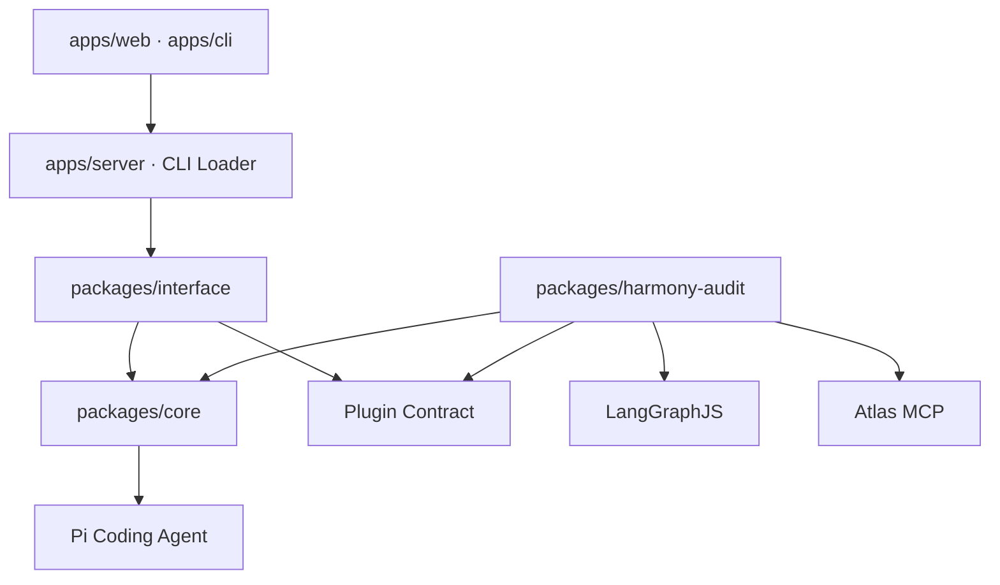

# Agent Platform v3.2 当前设计

本文是当前实现的权威设计说明。历史迁移过程和里程碑记录仅用于追溯，不再代表待实现架构。

## 1. 产品边界

系统由两个平级产品能力组成：

1. 通用 AI 助手，由平台内置，底层复用 Pi Coding Agent；
2. 自定义多 Agent 插件，通过通用 Plugin Contract 接入，插件可自行使用 LangGraph、MCP、Skill 和子 Agent。

HarmonyOS 白盒安全审计是首个插件，不是平台内核的一部分。平台不允许出现针对 `harmony-audit`、Capability、Component、Atlas、Finding 或六维验证的特殊分支。

## 2. 分层与依赖方向



依赖规则：

- `core` 不依赖任何领域插件；
- `interface`、Server、CLI 和 Web Shell 只依赖通用合同；
- 插件可以依赖 Core 的通用机制，但 Core 不反向调用插件内部类型；
- 插件 Web 资源由 contribution 装载，不复制到平台页面；
- 插件卸载后，通用助手和网关仍可构建、启动和使用。

根 workspace 只保存开发工具依赖。运行依赖由实际使用它的 package 自己声明，避免根项目通过依赖提升掩盖缺失声明。

## 3. 模块职责

### packages/core

- `PiSessionFactory`：创建交互助手 Session 和结构化 Worker Session；模型、认证、基础工具、重试、压缩和会话能力复用 Pi 官方实现。
- Plugin Contract：定义版本化 Manifest、配置校验、激活、Run、事件、动作、执行过程、Artifact、CLI 与 Web contribution。
- `McpManager`：管理平台配置的 stdio MCP 生命周期、并发上限、工具过滤和 setup call。
- `SubagentRuntime`：通用助手的隔离委派、并发控制、取消和过程事件。
- `RollingAgentPool`：领域无关的即时补槽调度算法；容量策略由调用插件决定。
- `SkillManager`：为结构化插件 Worker 装载插件自带的任务 Skill；通用助手的 Skill 仍由 Pi 管理。
- `GraphApplication`：LangGraph checkpoint 的薄启动适配，不解释领域节点。

已明确不自研：第二套模型目录、Provider/Auth 管理、基础 read/write/bash 工具实现，以及平台级的关键词 Orchestrator 路由。

### packages/interface

- `AssistantSessionService`：对话 Session、能力管理、MCP 注入和子 Agent 的应用服务；
- `PluginHostService`：插件激活、通用 Job 索引、Run 发现/收养、事件、动作、执行过程和 Artifact；
- `LocalGatewayState`：平台 SQLite、重启恢复、保留清理和 JSONL 日志。

该层不得 import Harmony 包或解释审计数据库。

### apps

- Server 只负责本地 HTTP/SSE、Bearer Token、静态资源、错误映射和文件传输；
- Web Shell 展示内置助手、通用能力管理、子 Agent 和插件目录；
- CLI 解析全局配置，再调用插件贡献的命令，不静态注册 Harmony 命令。

### Harmony Audit Plugin

插件独占以下能力：Harmony 项目解析、Atlas 索引和 MCP Profile、审计能力目录、任务 Skill、LangGraph 状态机、五槽并发策略、路径关联、六维验证、不变量、`run.db`、增量基线和报告。

## 4. 通用助手链路

```text
Web request
  -> AssistantSessionService
  -> PiSessionFactory
  -> Pi AgentSession
       -> Pi model/auth/settings
       -> Pi built-in tools and skills
       -> enabled platform MCP tools
       -> optional delegate_task
  -> session JSONL + platform subagent state
```

普通对话不经过 Plugin Host。它可以在没有任何插件时独立运行。`delegate_task` 创建的是通用助手子 Agent，不等同于插件内部由 LangGraph 调度的领域 Worker。

## 5. 插件生命周期

```text
discover module -> validate manifest/config -> activate runtime
  -> operation | createRun | discover/adoptRun
  -> status/events/executions/actions/artifacts
  -> dispose
```

Host 只持有平台 Job 到插件 Run Reference 的映射。Run 的真实状态、恢复规则和 Artifact 都由插件 Runtime 决定。Dummy Plugin 作为合同测试，保证新插件不需要修改平台代码。

## 6. Harmony 审计链路

```text
profile project + prepare Atlas index
  -> create run.db and graph.db
  -> component semantic analysis
  -> deterministic cross-component correlation
  -> exploitability validation
  -> deterministic JSON / Markdown / HTML reports
```

LangGraph 主图保存控制游标，`run.db` 保存任务、证据、Operation Group、Fact Edge、验证、Finding 和覆盖缺口。语义 Agent 与验证 Agent 使用独立任务上下文和 Atlas 工具集合；模型提交必须先通过 JSON Schema，再通过领域不变量，最后才能事务入库。

`RollingAgentPool` 实现通用滚动补槽，Harmony 插件把容量限制为最多 5。一个任务结束后立即补充下一个任务，不等待整批完成。

## 7. 状态与恢复

| 数据 | 所有者 | 事实地位 |
|---|---|---|
| Pi Session JSONL | Pi | 对话历史 |
| `gateway.db` | 平台 | Host Job 与通用子 Agent 本地索引 |
| `gateway.log` | 平台 | 脱敏运维日志 |
| `run.db` | Harmony 插件 | 审计状态和结论唯一事实源 |
| `graph.db` | Harmony 插件 | 可重建的 LangGraph 控制游标 |
| `report.*` | Harmony 插件 | 从事实库确定性生成的展示产物 |

网关启动时恢复平台索引，并调用插件的 `discoverRuns()`。Harmony 插件只扫描配置允许根目录下的合法 `reports/harmony-audit-*/run.db`。异常退出时仍运行的任务会被明确标记为中断，随后可通过插件恢复动作重新执行。

保留清理只删除平台终态索引，不删除插件事实库、报告或 Pi 会话。

## 8. 配置所有权

- Pi `models.json`：Provider 和模型目录；
- Pi `settings.json`：默认模型、Session、Retry、Compaction、Skills、Extensions 和 Packages；
- Pi `auth.json` 或环境变量：认证；
- `agent-platform.json`：MCP Server、通用子 Agent、本地可靠性和插件装配；
- Harmony 插件配置：Atlas、允许目录、五槽容量和历史发现策略。

平台配置不再接受旧 `agent.toml` 或重复的自定义 Provider 结构。

## 9. 当前部署模型

当前是单用户、单机、单进程网关：默认绑定 `127.0.0.1`，可选 Bearer Token，状态使用本地 SQLite 和文件系统。这一模型已经具备本地生产可用性。

公网暴露、多人认证授权、多租户、集中数据库和分布式 Worker 属于未来部署模型变化，不在当前设计中预留伪实现。

## 10. 变更准入

任何架构变更至少满足：

- `pnpm check`、`pnpm test`、`pnpm build` 全部通过；
- 平台包不得新增 Harmony 领域 import 或名称分支；
- 新插件仅通过 Plugin Contract 接入；
- 新模型、认证、基础工具和通用 Session 能力优先复用 Pi；
- 审计结论只能来自通过 Schema 与领域不变量验收的事实；
- 修改恢复语义时必须覆盖异常重启和幂等恢复测试。
