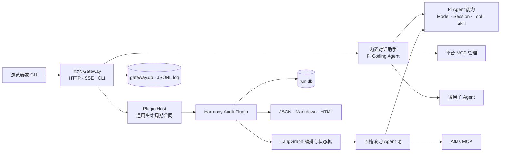

# harmonySecAnalyzer v3.2

一个面向本机使用的通用 AI 助手网关，支持以插件方式接入基于 LangGraph 的自定义多 Agent 能力。当前内置通用对话助手，并安装了首个领域插件：HarmonyOS ArkTS 白盒安全审计。

当前版本已经达到单机网关形态下的生产可用基线：对话、插件审计、任务过程、报告、状态持久化、重启恢复、本地日志和诊断均已形成闭环。后续工作以审计能力演进和生产强化为主。

## 架构概览



平台与插件之间只有通用合同依赖。项目解析、Atlas 调用、路径发现、六维验证、PoC 生成、审计事实和报告全部归 Harmony 插件所有，平台代码不解释任何鸿蒙审计语义。

项目建模以 Ability/ExtensionAbility 为分析单元，不为模块创建独立的 CommonEvent 审计任务；相关代码在所属组件语义范围内处理。

详细设计见 [DESIGN.md](DESIGN.md)，文档入口见 [架构契约索引](docs/architecture/README.md)。

## 环境要求

- Node.js 22.19 或更高版本
- pnpm 11
- Harmony 审计还需要可执行的 Atlas CLI

```bash
pnpm install
pnpm check
pnpm test
pnpm build
```

## 配置

仓库只提交空白示例；`config/` 下的正式配置已被忽略，可安全填写本机路径和凭据引用。

```bash
mkdir -p config/pi-agent
cp docs/examples/pi-agent/settings.json config/pi-agent/settings.json
cp docs/examples/pi-agent/models.json config/pi-agent/models.json
cp docs/examples/agent-platform.json config/agent-platform.json
```

配置所有权：

| 文件 | 内容 |
|---|---|
| `config/pi-agent/models.json` | Pi 官方 Provider 与模型目录，模型只定义一次 |
| `config/pi-agent/settings.json` | Pi 官方默认模型、Session、Retry、Compaction、Skills 和 Packages |
| `config/pi-agent/auth.json` | 可选的 Pi 官方认证存储，不提交 |
| `config/agent-platform.json` | 平台 MCP、通用子 Agent、本地可靠性和插件配置 |

推荐通过环境变量提供密钥：

```bash
export AGENT_PLATFORM_MODEL_API_KEY='...'
export AGENT_PLATFORM_PI_DIR="$PWD/config/pi-agent"
export AGENT_PLATFORM_CONFIG="$PWD/config/agent-platform.json"
export AGENT_PLATFORM_WEB_TOKEN='a-random-local-token'
```

模型引用使用 Pi 的 `provider/model-id` 格式。多个模型都写在 `models.json` 中，助手和插件配置只选择模型，不重复填写 API Key 或 Base URL。

MCP Server 示例：

```json
{
  "mcp": {
    "maxSessions": 5,
    "servers": {
      "example": {
        "enabled": true,
        "command": "/absolute/path/to/server",
        "args": ["--stdio"],
        "allowedTools": ["search"],
        "timeoutMs": 60000
      }
    }
  }
}
```

## 启动 Web

```bash
pnpm web
```

打开 `http://127.0.0.1:4173`。默认只监听本机回环地址。

Web 中可选择：

- 对话助手：模型选择、流式消息、工具过程、历史会话和通用子 Agent；
- 能力管理：Pi Skills、Extensions、Packages 和平台 MCP Server；
- Harmony 审计：项目解析、范围选择、五槽任务过程、失败恢复、Finding、覆盖缺口和报告。

网关状态默认保存在平台配置旁的 `.agent-platform/`。服务重启后会恢复平台任务索引，重新发现允许目录中的 Harmony 历史运行，并把崩溃时仍在执行的任务标记为可诊断、可恢复的中断状态。

诊断接口：

- `GET /api/health`
- `GET /api/reliability`
- `POST /api/reliability/actions/prune`

## 运行 Harmony 审计

在 `config/agent-platform.json` 中配置插件：

```json
{
  "plugins": {
    "modules": ["@agent-platform/harmony-audit"],
    "configs": {
      "harmony-audit": {
        "atlasExecutable": "/absolute/path/to/atlas",
        "allowedRoots": ["/absolute/path/to/auditable/projects"],
        "capacity": 5,
        "discoverHistory": true
      }
    }
  }
}
```

Web 页面可直接创建审计。CLI 等价入口：

```bash
pnpm agent -- audit /absolute/path/to/HarmonyOS-project
pnpm agent -- audit /absolute/path/to/HarmonyOS-project --incremental
pnpm agent -- status /absolute/path/to/reports/harmony-audit-<run-id>
pnpm agent -- resume /absolute/path/to/reports/harmony-audit-<run-id> --capacity 5
pnpm agent -- cancel /absolute/path/to/reports/harmony-audit-<run-id>
pnpm agent -- report /absolute/path/to/reports/harmony-audit-<run-id>
```

`--capability` 和 `--component` 可重复传入；增量模式不能与范围过滤同时使用。首次增量审计前需要完成一次无过滤、无覆盖缺口的全量审计。

每次运行在目标项目的 `reports/harmony-audit-<run-id>/` 下生成：

- `run.db`：审计状态与事实的唯一事实源；
- `graph.db`：LangGraph 可恢复控制游标；
- `report.json`、`report.md`、`report.html`；
- `attack-matrix.json`。

## 工程结构

| 目录 | 职责 |
|---|---|
| `packages/core` | Pi Session 适配、Plugin Contract、MCP、通用子 Agent、滚动池和 LangGraph 薄适配 |
| `packages/interface` | 对话与 Plugin Host 应用服务、本地持久化 |
| `packages/harmony-audit` | 完整 Harmony 白盒安全审计插件 |
| `packages/dummy-plugin` | 插件合同的最小兼容性测试夹具 |
| `apps/server` | 本地 HTTP/SSE 网关和认证 |
| `apps/web` | 领域无关 Web Shell 与内置对话页面 |
| `apps/cli` | 通用插件 CLI contribution 装载器 |

## 部署边界

当前定位是单用户、单进程、本机网关，不直接面向公网。若未来改为多人或远程服务，需要另行增加 HTTPS、身份与权限、多租户、集中式存储和分布式调度；这些不是当前单机基线的缺口。
