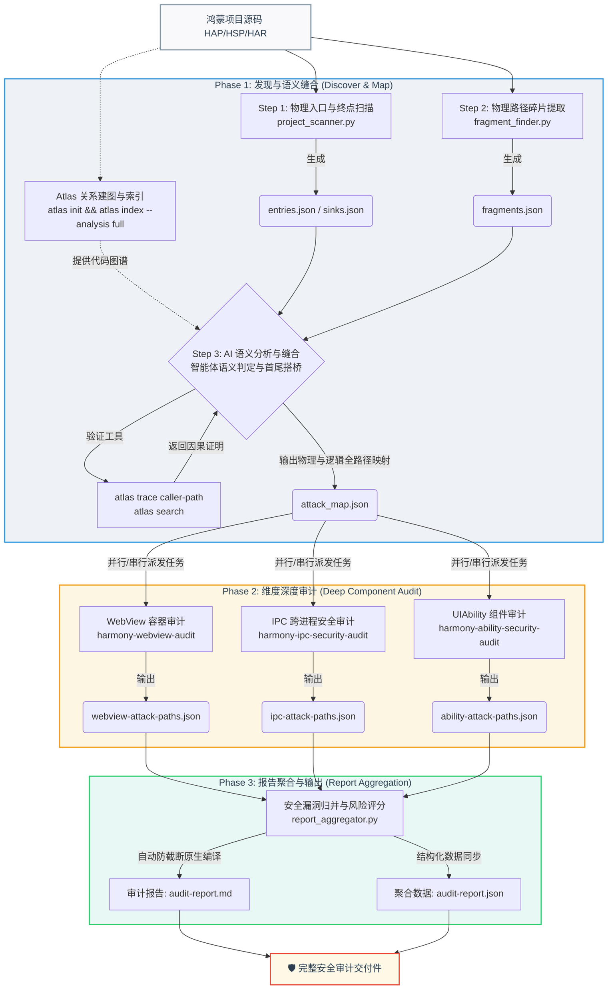

# harmonySecAnalyzer (鸿蒙应用安全审计 Agent 引擎)

`harmonySecAnalyzer` 是一个面向鸿蒙系统（OpenHarmony / HarmonyOS）应用程序的安全审计与攻击路径分析引擎。该项目通过**“AI 推理智能分析”**与**“静态代码关系校验”**相结合的双轨级联设计，自动从外部输入入口追踪数据流向，检测并验证可达的完整攻击路径（Attack Paths）。

---

## 🛠️ 核心架构与模块设计

本项目采用**智能体驱动原生双轨安全审计架构 (Agent MCP-Driven Dual-Track Architecture)**，将安全审计管线高度工程化、结构化，整体全景工作流图谱如下：



---

### 1. 静态扫描与路径关系梳理阶段 (Phase 1: Static Analysis & Path Mapping)
该阶段深度结合物理特征匹配与 Atlas 本地依赖图谱，提取并装配出潜在攻击路径网络。
*   **Step 1: 静态物理特征扫描**：运行 `project_scanner.py`，解析项目中的硬编码配置与文件引用，生成 `<audit_dir>/entries.json` 与 `<audit_dir>/sinks.json`。
*   **Step 2: Atlas 关系建图与初始化**：由 Agent 自动在宿主目录中拉起 `atlas init && atlas index --analysis full`，在本地构建具有完整数据流与控制流图谱（CFG）的精确依赖与调用关系 SQLite 数据库。这一步解决了在未手动建图时调用链无法获取的致命问题。基于 v1.4.0 的 Capability-Aware Indexing，若请求更深度的分析模式，将自动对即使内容匹配的 clean 文件执行重提取更新，确保审计链的可信度下限。
*   **Step 3: 级联拓扑碎片提取与语义搭桥**：运行 `fragment_finder.py` 得到前向/反向路径碎片 `fragments.json`。由 AI 直连运行 `atlas trace caller-path` 对碎片进行语义交联与可达性判定，消除误报，首尾缝合后写入 `<audit_dir>/attack_map.json`。

### 2. 漏洞深度验证阶段 (Phase 2: Verification)
由 AI 编排器（`agent_v2.md`）调度不同的审计 Skill 对 `attack_map.json` 中的各路径进行并行或级联分析：
*   **轨道一：IPC 服务自闭环审计 (`skills_v2/harmony-ipc-security-audit`)**
    *   对 IPC 服务进行垂直深度研判，分析连接校验（`onConnect`）和消息分发（`onRemoteMessageRequest`）的各个业务分支安全缺陷。
*   **轨道二：UIAbility 与 WebView 级联审计**
    *   **阶段 1 (`skills_v2/harmony-ability-security-audit`)**：审计 Ability 入口前置包名校验及重入一致性问题，并借助 Atlas 静态搜索及逆向调用链追踪受污参数经由 ArkTS 状态管理（`AppStorage`、`LocalStorage`）和路由（`router.pushUrl`）跨文件的传递路径。若受污参数流入 WebView，则生成 **Warm-Start Context JSON**。
    *   **阶段 2 (`skills_v2/harmony-webview-audit`)**：若无 Warm-Start JSON 则自动剪枝跳过。若存在，AI 将聚焦分析 Web 组件关联的 JS Bridge（Native 越权方法）及拦截器（弱域名过滤漏洞），并缝合端到端利用链。

### 3. 报告聚合与生成阶段 (Phase 3: Reporting)
*   **实现模块**：`skills_v2/harmony-report-generator/`
*   **功能**：对各阶段生成的多份攻击路径 JSON 碎片进行内容完整性、格式规范性校验。按照预定义渲染公式合成 Markdown 报告，自动进行风险评分，并输出漏洞修复建议。
*   **产出物**：
    *   `<audit_dir>/audit-report.md`（原生自动防截断分级渲染的 Markdown 报告）
    *   `<audit_dir>/audit-report.json`（完整结构化聚合数据）

---

## 📂 项目目录结构

```
├── README.md                              # 项目说明文档
├── AGENTS.md / CLAUDE.md                 # Atlas 代码智能协作契约手册
├── agent_v2.md                           # 智能体原生双轨编排管线核心说明
├── skills_v2/                            # 审计技能库 (Skills v2)
│   ├── harmony-project-parser/           # 项目扫描与特征发现技能 (Phase 1)
│   │   └── scripts/
│   │       └── project_scanner.py        # 静态资源与入口/Sink 发现核心脚本
│   ├── harmony-ipc-security-audit/       # 轨道一：IPC 通信安全审计技能 (Phase 2)
│   ├── harmony-ability-security-audit/   # 轨道二：UIAbility 入口防卫与状态流向追踪技能 (Phase 2)
│   ├── harmony-webview-audit/            # 轨道二：WebView JS Bridge 与拦截器专项分析技能 (Phase 2)
│   └── harmony-report-generator/         # Phase 3：多源报告校验、缝合与聚合生成技能
│       └── scripts/
│           └── report_aggregator.py      # 报告数据聚合、Deduplication 与多路径归并脚本
```

---

## 🚀 审计运行工作流示范

当您需要针对一个全新的鸿蒙项目进行安全分析时，遵循以下执行步骤：

### 1. 扫描项目与路径关系梳理 (Phase 1)
这是整个审计工作流的第一阶段，包括静态扫描、依赖图谱初始化以及双向碎片缝合：

* **Step 1: 扫描物理入口与物理终点**
  根据项目规模，支持全局扫描与超大型模块化拆分扫描：
  
  **方式 A：中小型项目（一次性扫描）**
  ```bash
  python skills_v2/harmony-project-parser/scripts/project_scanner.py <target_project_path> -o <audit_output_dir> --pretty
  ```

  **方式 B：超大型项目（分模块独立任务派发 + 全局合并，规避超时）**
  ```bash
  # 1. 独立派发各个模块扫描（纯单线程运行，轻量安全）
  python skills_v2/harmony-project-parser/scripts/project_scanner.py <target_project_path> --module-dir <target_project_path>/entry -o <audit_output_dir> --pretty
  python skills_v2/harmony-project-parser/scripts/project_scanner.py <target_project_path> --module-dir <target_project_path>/feature_module -o <audit_output_dir> --pretty
  
  # 2. 全局分片合并
  python skills_v2/harmony-project-path/scripts/project_scanner.py <target_project_path> --merge -o <audit_output_dir> --pretty
  ```

* **Step 2: 建立 Atlas 代码索引**
  进入目标项目源码目录，对代码库进行语义和调用关系索引：
  ```bash
  cd <target_project_path>
  # 1. 初始化 Atlas
  atlas init
  # 2. 极速生成完整数据流与控制流图谱（CFG）索引 (Atlas v1.4.0)
  atlas index --analysis full
  ```

* **Step 3: 提取路径碎片与语义搭桥**
  运行碎片提取脚本并结合 AI 运行本地 `atlas trace` / `atlas search` 命令自动进行图分析桥接，生成最终攻击映射图 `attack_map.json`：
  ```bash
  python skills_v2/harmony-project-parser/scripts/fragment_finder.py <target_project_path> -o <audit_output_dir>
  ```

### 2. 驱动 AI Agent 执行路径验证 (Phase 2)
根据 `agent_v2.md` 的编排流程：
1. 启动并批量分发 **轨道一 (IPC)** 和 **轨道二阶段 1 (Ability)** 审计任务。
2. 检查 `<audit_output_dir>/` 下是否生成了 `harmony-webview-warm-start-*.json` 级联上下文。
3. 如有，批量启动 **轨道二阶段 2 (WebView)** 审计任务。

### 3. 聚合数据并原生输出报告 (Phase 3)
运行聚合脚本，指定 `-o` 和 `-m` 参数，即可在 2 毫秒内自动在端侧编译出全量报告，完美避开 AI 输出截断痛点：
```bash
python skills_v2/harmony-report-generator/scripts/report_aggregator.py <audit_output_dir> -o <audit_output_dir>/aggregated_data.json -m <audit_output_dir>/audit-report.md --pretty
```

---

## 📦 Atlas 依赖与环境配置指引 (macOS & Windows)

本项目深度依赖 **Atlas v1.4.0** 预编译 CLI 工具提供的本地代码关系数据库及数据流追踪能力。在运行审计前，请根据您所处的操作系统安装并正确配置 Atlas 环境。

### 1. 基础系统依赖与运行环境
- **SQLite 3**: Atlas 使用 SQLite 作为本地数据事实库（存放于项目根目录下的 `.atlas/atlas.db`）。
  - **macOS**: 默认内置了 `sqlite3`。
  - **Windows**: 确保本地系统支持 SQLite 3，且支持 FTS5 全文搜索插件（现代 SQLite 3 版本如 3.9.0 及以上默认编译包含 FTS5）。
- **C/C++ 运行时环境 (仅 Windows 需要)**:
  - 建议安装 [Microsoft Visual C++ Redistributable (MSVC)](https://learn.microsoft.com/en-us/cpp/windows/latest-supported-vc-redist) 以保证相关原生依赖能正常加载。

---

### 2. macOS 平台配置

#### A. 二进制文件安装与授权
1. 下载适用于 macOS 平台的 `atlas` 二进制包。
2. 将 `atlas` 拷贝到您的系统环境变量 `PATH` 所含目录中（例如 `/usr/local/bin` 或 `/opt/homebrew/bin`）。
3. 授予可执行权限：
   ```bash
   chmod +x /usr/local/bin/atlas
   ```
4. 如果因“无法验证开发者”而被 macOS 系统拦截，可在终端中执行以下命令解除隔离属性：
   ```bash
   xattr -d com.apple.quarantine /usr/local/bin/atlas
   ```

#### B. 命令行验证
在终端中执行以下命令校验安装：
```bash
atlas --version
```
输出应显示 `v1.4.0` 或更高版本。

#### C. 环境变量配置
您可以在 `~/.zshrc` 或 `~/.bash_profile` 中配置以下环境变量：
```bash
# （可选）配置 Atlas 日志级别，调试数据流建图时可设为 debug
export ATLAS_LOG_LEVEL=info

# （可选）配置并行索引 worker 数，根据 CPU 核心数进行调整
export ATLAS_PARSE_CONCURRENCY=4

# （可选）配置自定义 Atlas 数据库存储路径（默认在各项目的 .atlas/ 目录下）
# export ATLAS_DB_PATH="/path/to/custom/atlas.db"
```
保存后运行 `source ~/.zshrc`（或对应配置文件）使之生效。

---

### 3. Windows 平台配置

#### A. 二进制文件安装
1. 下载适用于 Windows 平台的 `atlas.exe` 压缩包。
2. 解压并将 `atlas.exe` 移动到自定义目录中（例如 `C:\Program Files\Atlas\`）。

#### B. 系统环境变量 PATH 配置
1. 按下 `Win + R` 键，输入 `sysdm.cpl` 并回车，打开系统属性。
2. 切换到 **“高级” (Advanced)** 选项卡，点击下方的 **“环境变量” (Environment Variables)**。
3. 在 **“系统变量” (System Variables)** 或 **“用户变量” (User Variables)** 中找到 `Path`，双击编辑。
4. 点击 **“新建” (New)**，将解压的 `atlas.exe` 所在目录路径（例如 `C:\Program Files\Atlas\`）添加进去。
5. 一路点击“确定”保存设置。

#### C. 命令行验证
重新打开 **PowerShell** 或 **命令提示符 (CMD)**，运行：
```powershell
atlas --version
```
输出应正常打印版本信息，如 `v1.4.0`。

#### D. 环境变量配置 (CMD & PowerShell)
- **临时设置 (CMD)**:
  ```cmd
  set ATLAS_LOG_LEVEL=info
  set ATLAS_PARSE_CONCURRENCY=4
  ```
- **临时设置 (PowerShell)**:
  ```powershell
  $env:ATLAS_LOG_LEVEL="info"
  $env:ATLAS_PARSE_CONCURRENCY=4
  ```
- **永久设置**:
  在上述“系统属性 -> 环境变量”窗口中，点击“新建”添加对应的系统或用户变量即可。
