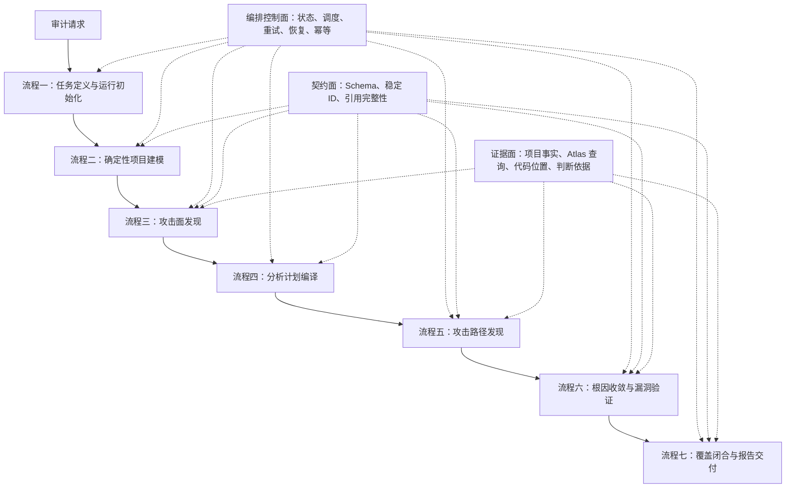
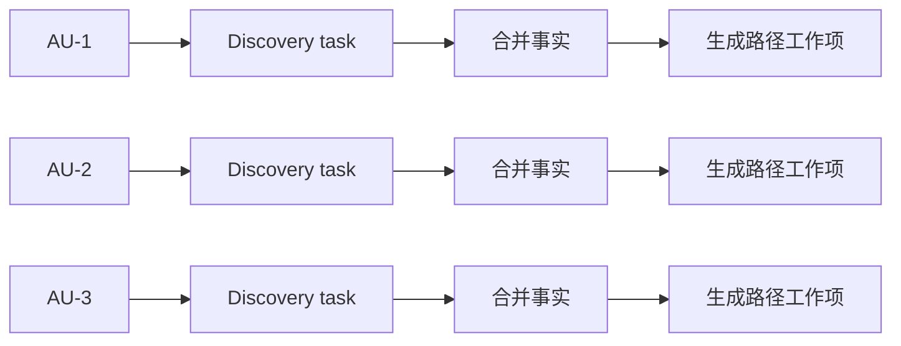
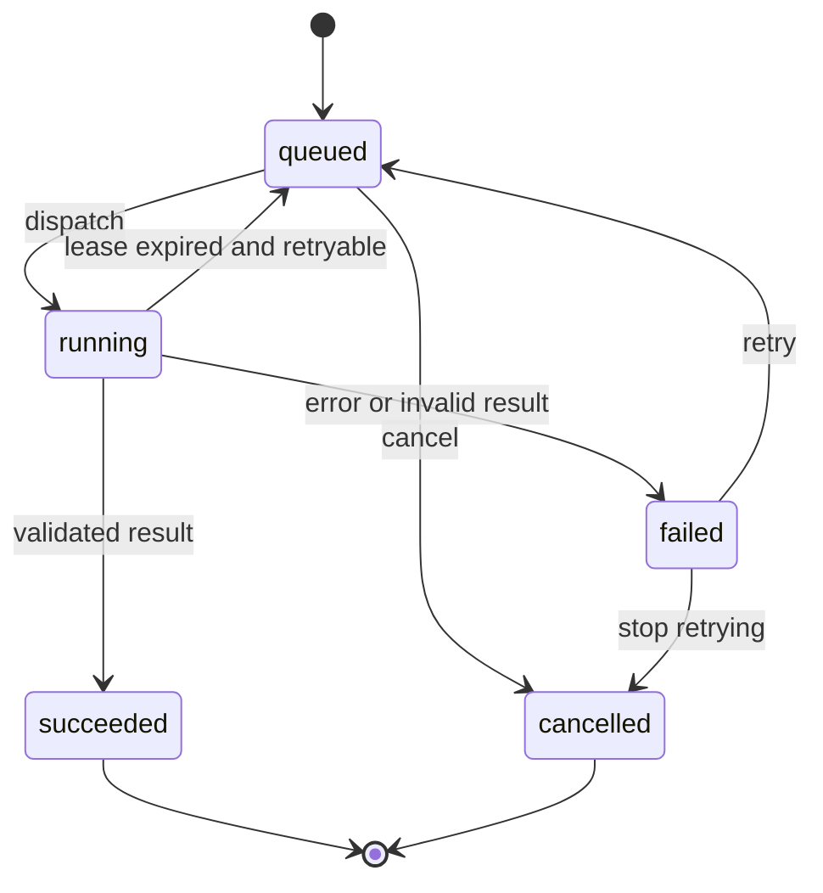

# harmonySecAnalyzer 目标工作流架构

> 本文从工作流编排角度描述 harmonySecAnalyzer 的最终目标架构。
>
> 它回答三个问题：系统由哪些大流程组成、每个流程具体完成什么工作、各流程如何通过确定性契约连接成一条可验证的审计流水线。
>
> 本文不以当前已经存在的 Agent、脚本或迭代版本为边界。现有实现只是目标架构的一部分，后续实现应向本文收敛。

## 1. 目标与边界

### 1.1 最终目标

harmonySecAnalyzer 的目标不是“让多个 AI 阅读代码并生成一份报告”，而是建立一个可编排、可恢复、可度量、可复核的白盒安全审计系统：

1. 将大型 HarmonyOS/OpenHarmony 工程拆成有限、明确的分析对象。
2. 使用确定性工具生成项目事实、代码关系和数据流证据。
3. 使用 AI 对有界上下文进行业务语义、安全边界和防护有效性判断。
4. 保证每个计划分析的对象都有明确去向，不能静默遗漏。
5. 只有证据链闭合且漏洞成立条件全部满足时，才输出已确认漏洞。
6. 审计中断后可以恢复，重复执行不会造成结果叠加或重复报告。
7. 任意报告结论都能追溯到项目事实、分析任务和工具查询证据。

### 1.2 核心原则

- **工作流先于 Agent**：流程定义系统必须完成的工作，Agent 只是工作执行者之一。
- **确定性事实与语义判断分离**：配置解析、ID 分配、任务路由、状态迁移、覆盖校验由程序完成；业务意图、攻击语义、guard 有效性和安全影响由 AI 在证据约束下判断。
- **计划驱动而非自由探索**：每一阶段先形成待分析对象，再派发任务，最后检查所有对象是否进入合法终态。
- **证据先于结论**：外部可达、敏感能力和调用链分别只是 exposure、capability 和 path，不能直接等同于 vulnerability。
- **反证优先**：验证阶段优先寻找正常业务意图、有效防护、控制力中断和安全边界未被突破的证据。
- **流式推进**：上游工作项完成后即可产生下游任务，不要求整个阶段全部完成后再开始下一阶段。
- **失败显式化**：无法分析、工具能力不足、证据缺失和任务失败必须成为结构化状态，不能被当作“未发现漏洞”。
- **能力可插拔**：Web、ICC、加密、依赖、NAPI 等领域能力通过统一契约接入，不改变主工作流。

## 2. 总体分层

系统由一个贯穿全程的编排控制面、七个业务流程和三个横切支撑面组成。



### 2.1 七个业务流程

| 流程 | 核心问题 | 主要产物 |
|---|---|---|
| 一、任务定义与运行初始化 | 本次审计要分析什么，以什么能力和版本分析？ | run manifest、scope policy、能力清单 |
| 二、确定性项目建模 | 目标工程由什么组成，配置层暴露了哪些候选入口？ | project model、discovery units |
| 三、攻击面发现 | 每个项目单元中有哪些真实入口、敏感能力和边界？ | raw entries、raw danger seeds、query evidence |
| 四、分析计划编译 | 哪些入口和危险能力需要建立路径关系？ | normalized model、path analysis plan |
| 五、攻击路径发现 | 外部影响是否能够到达安全敏感操作？ | candidate、rejected、no path、analysis gap |
| 六、根因收敛与漏洞验证 | 多条路径是否指向同一根因，该根因是否构成漏洞？ | root-cause candidates、分层验证结论 |
| 七、覆盖闭合与报告交付 | 是否分析完整，结论是否可交付和复现？ | coverage result、findings、report、run snapshot |

### 2.2 三个横切支撑面

- **编排控制面**：负责工作项生命周期、并发槽位、任务租约、重试、恢复、取消、事件日志和最终状态。
- **契约面**：负责 JSON Schema、稳定身份、枚举约束、跨产物引用和版本兼容。
- **证据面**：负责保存每个事实和判断对应的配置位置、代码位置、Atlas query ID、调用链、数据流和反证。

### 2.3 当前实现状态说明

以下状态是截至 2026-07-16 的实现快照。状态描述的是目标能力是否形成闭环，不是目录或文件是否存在。

| 状态 | 定义 |
|---|---|
| **已实现** | 目标流程的核心输入、执行、产物和完成校验均已落地，可以进入主审计链路 |
| **部分实现** | 已具备可运行能力，但仍缺少目标态中的契约、覆盖、恢复、流式化或领域扩展 |
| **未实现** | 目前只有设计、预留目录或说明，尚未接入实际审计链路 |

### 2.4 七个流程的实现映射

| 流程 | 状态 | 已实现的组件 | 尚未完成的目标能力 |
|---|---|---|---|
| 一、任务定义与运行初始化 | **部分实现** | `/audit` Command；`harmony-auditor` Agent；`audit-workflow`、`audit-orchestration` Skill；状态机 `new-run/init/status` | scope policy 编译、能力可用性检查、独立 run manifest、版本冻结、不支持 scope 的启动期拒绝、正式 session 终态 |
| 二、确定性项目建模 | **部分实现（ArkTS 核心已实现）** | `project-modeling` Skill；`project_profiler.py`；Python `json5`；状态机 project model 准入 | 更完整的工程类型适配、正式 JSON Schema、native/依赖等扩展建模；这些扩展不阻塞当前 ArkTS JSON5 项目模型 |
| 三、攻击面发现 | **部分实现** | `attack-surface-mapper` Agent；Atlas MCP 的 `project/search/symbol/explore/calls/file_dependencies`；entry/seed/query evidence/discovery plan 产物 | discovery unit 任务化、多个 mapper 并发、worker 私有结果与状态机合并、单 unit 完成后流式下发、NAPI/native discovery adapter |
| 四、分析计划编译 | **部分实现（核心已实现）** | 状态机 `compile-matrix`；execution entry 与 danger seed 归一化；稳定 entry/seed/work key；数据驱动模式路由；稀疏 `attack_matrix.json`；逐 work item 覆盖台账 | Capability Registry、scope 驱动路由、正式 JSON Schema、更多领域 route/pattern |
| 五、攻击路径发现 | **部分实现（核心已实现）** | `path-finder` Agent；一 work item 一任务；`attack-patterns` Skill；Atlas MCP 的 `path/trace/calls/search/symbol/explore`；五项 admission 机器校验；`analysis_gap` 终态 | 正式结果 JSON Schema、更多领域化 path strategy、Atlas 能力缺口补充分析器 |
| 六、根因收敛与漏洞验证 | **部分实现** | 状态机 streaming promotion；`seed_key + pattern` 初版去重；`path-validator` Agent；六门槛与分层结论；Atlas `impact` 等验证查询 | 完整 root cause identity、危险参数/边界/guard 维度去重、六门槛机器级完整校验、证据引用完整性校验、领域 validator 扩展 |
| 七、覆盖闭合与报告交付 | **部分实现** | 状态机 `validate-coverage/validate-ready/finalize`；project/discovery/attack matrix/candidate 任务闭合；报告产物复核与 session completed 终态；`report-composer` Agent；`findings.json`、`report.md` | 冻结 report snapshot、coverage.json、产物 hash、完整报告 schema/引用校验、triage/replay/再报告、HTML/PDF/SARIF 导出 |

### 2.5 当前组件清单

#### Agent

| 组件 | 状态 | 当前职责 |
|---|---|---|
| `harmony-auditor` | **已实现** | 主编排者，调用确定性脚本、Atlas 和 subagent 推进审计流程 |
| `attack-surface-mapper` | **已实现，流程待拆分** | 消费 project model/discovery plan，通过 Atlas 发现入口和危险种子；当前一次处理整个 plan |
| `path-finder` | **已实现** | 按攻击矩阵指定的单个 entry/sink/pattern work item 分析路径，执行五项候选准入 |
| `path-validator` | **已实现，契约待加强** | 按根因候选执行反证优先六门槛验证并输出分层结论 |
| `report-composer` | **已实现，交付闭环待加强** | 汇总结构化结果，生成 `findings.json` 和 `report.md` |
| 独立 crypto/network/ICC/Web/dependency/NAPI Agent | **未实现** | 当前由通用 mapper/finder/validator 加载有限模式处理；目标态是否拆成独立 Agent 由能力路由决定，不作为主流程硬依赖 |

#### Skill 与确定性脚本

| 组件 | 状态 | 当前职责 |
|---|---|---|
| `audit-workflow` Skill | **已实现** | 当前端到端 SOP、阶段边界和报告准入要求 |
| `audit-orchestration` Skill | **已实现** | 状态机命令、任务池、候选晋级、覆盖校验协议 |
| `audit_orchestrator.py` | **部分实现** | run 隔离、JSON/JSONL 状态、5 槽队列、事件日志、结果路径下发、最多 3 次自动重试与人工 retry、entry/sink 归一化、discovery unit 矩阵剪枝、中间节点排除、稀疏攻击矩阵、work item 覆盖、候选准入、初版根因去重、报告准入与 session finalize |
| `project-modeling` Skill | **已实现** | 确定性项目模型和 discovery plan 契约 |
| `project_profiler.py` | **已实现** | 使用 `json5` 解析工程配置，生成 component、dependency、entry candidate 和 discovery unit |
| `attack-patterns` Skill | **部分实现** | 提供已有攻击链形状、正常业务、guard 和降级规则；领域覆盖仍有限 |
| `atlas-query-patterns` Skill | **未实现** | 规划中的 Atlas 查询模式知识模块 |
| ArkTS 漏洞知识、权限映射、ICC、加密、CWE、报告模板等独立 Skill | **未实现** | 当前只有部分知识散落在 `attack-patterns` 和 `knowledge/patterns` 中，尚未形成独立可路由能力 |
| NAPI boundary、Semgrep authoring Skill | **未实现** | 仅作为未来扩展方向 |

#### MCP、Command、Plugin 与其他工具

| 组件 | 状态 | 当前职责 |
|---|---|---|
| Atlas MCP | **已接入** | ArkTS 符号定位、上下文、调用、依赖、路径、数据流和影响分析；当前主流程的代码理解底座 |
| `/audit` Command | **已实现，scope 语义部分实现** | 启动审计；scope 当前会记录，但尚未完整编译为机器能力策略 |
| `/triage`、`/report` Command | **未实现** | 目标态用于人工复核、再报告和导出 |
| OpenCode Plugin | **未实现** | `.opencode/plugins` 当前仅预留；尚无统一工具事件采集、异步 child session 或运行轨迹插件 |
| OpenCode Custom Tool | **未实现** | 尚未实现 Atlas 复合查询、装饰器分析、CVE 查询等 custom tool |
| Semgrep | **未接入** | 当前不属于主流程；未来只能作为 discovery/seed provider 接入统一工作流 |
| ArkTS 装饰器/异步状态流分析器 | **未实现** | 目标态用于补充 Atlas 当前不覆盖的语义 |
| NAPI/native 分析器 | **未实现** | 目标态使用独立 C/C++ 策略并转换为统一工作流契约 |

### 2.6 横切能力的实现映射

| 横切能力 | 状态 | 当前已有 | 主要缺口 |
|---|---|---|---|
| 编排控制面 | **部分实现** | 文件锁、原子重写、5 槽并发、queue、事件日志、结果缺失/无效自动 retry、人工 retry、streaming promotion、run 隔离、finalize 终态 | lease、超时、resume/cancel、complete 全面幂等、真正异步滑动池 |
| 契约面 | **部分实现** | project model/discovery plan `schema_version`、Prompt 中的结果示例、部分枚举和 admission 检查 | 独立 JSON Schema、成熟 schema validator、所有产物严格校验、版本迁移、损坏 JSONL 显式失败 |
| 稳定身份与去重 | **部分实现** | execution entry 别名合并、normalized seed identity、稳定 work key、candidate index、`seed_key + pattern` 初版根因指纹 | 完整 root cause key、算法版本化、危险参数/边界/guard 维度的过度合并与漏合并防护 |
| 证据面 | **部分实现** | Atlas query evidence、路径节点、taint flow、guard、六门槛说明 | 跨产物引用机器校验、证据 hash、完整 provenance graph、报告引用可解析性校验 |
| 覆盖度量 | **部分实现** | project candidate 去向、discovery unit 终态、raw seed 归一化、attack matrix work item 和 candidate validation 闭合 | domain/scope 覆盖、正式 coverage artifact、报告后闭合 |
| 恢复与重放 | **未实现** | run 目录和事件日志提供了手工排查基础 | 自动恢复、局部重试、冻结快照、离线 replay、run revision |
| 质量评测 | **部分实现** | profiler/orchestrator 单元测试、一个真实项目人工验证 | 漏洞/正常业务 golden corpus、误报漏报指标、固定产物回归、跨模型稳定性评测 |

## 3. 流程一：任务定义与运行初始化

### 3.1 目的

把用户的自然语言审计请求转换成一份不可歧义、可执行的审计任务，并为本次运行建立隔离环境。

### 3.2 具体工作

1. 规范化目标仓路径，确认仓库存在且具备支持的工程结构。
2. 解析审计 scope，例如 `full`、`quick`、`manifest`、`web`、`icc`、`crypto`、`dependency`、`napi`。
3. 将 scope 编译为机器可执行的 capability policy：
   - 启用哪些项目建模能力。
   - 启用哪些 discovery unit 类型。
   - 启用哪些 source、sink、pattern 和领域验证器。
   - 哪些领域不在本次覆盖范围。
4. 检查运行依赖和能力版本，例如 Python 依赖、Atlas 可用性、领域扩展是否安装。
5. 为本次审计原子创建独立 run 目录，禁止复用历史产物。
6. 固化运行元数据：目标仓版本、scope、schema 版本、分析器版本、知识库版本和启动时间。
7. 初始化状态机、事件日志、任务队列、产物目录和失败恢复信息。

### 3.3 输入与输出

**输入**：用户请求、目标仓路径、scope、可选运行参数。

**输出**：

- `run_manifest.json`
- `scope_policy.json`
- `session.json`
- 初始事件日志与空任务队列

### 3.4 完成条件

- run 目录唯一且为空。
- scope 已被编译为明确能力集合，而不是只保存一个字符串。
- 所有必要依赖可用；不支持的 scope 应在启动阶段明确失败。
- 本次运行所使用的版本信息已经冻结。

## 4. 流程二：确定性项目建模

### 4.1 目的

不依赖 AI 猜测，生成目标工程的配置事实、模块边界和源码分析锚点，为后续 Atlas 查询建立有限分析空间。

### 4.2 具体工作

1. 使用成熟解析库读取 `app.json5`、`module.json5`、build profile、依赖清单等结构化文件。
2. 建立 application、module、ability、extension、permission、dependency 等实体关系。
3. 提取 Manifest 层面的入口候选：
   - exported component
   - skills/action/entity
   - deeplink/URI
   - extension/provider
   - 权限与可见性约束
4. 生成源码定位锚点，例如 module scope、source root、component class、lifecycle method 和文件提示。
5. 按模块、组件或入口候选切分 discovery unit。
6. 记录解析错误、缺失配置、冲突和不支持的工程结构。
7. 生成项目模型覆盖摘要，明确哪些配置被读取、哪些没有被成功解释。

### 4.3 边界

- 本流程只处理确定性工程事实，不通过逐文件扫描推断源码业务逻辑。
- 不判断入口是否真的到达敏感能力。
- 不判断任何配置是否构成漏洞。
- ArkTS、C/C++、依赖漏洞等源码能力可以共用项目模型，但后续使用不同 discovery adapter。

### 4.4 输入与输出

**输入**：目标仓、scope policy。

**输出**：

- `project/project_model.json`
- `analysis/discovery_plan.json`
- 项目建模 diagnostics

### 4.5 完成条件

- 每个受支持 module 都有明确解析状态。
- 每个入口候选都归属于一个 discovery unit。
- schema、ID 和跨实体引用有效。
- 解析不完整时进入 `partial` 或 `failed`，不能静默按完整项目继续。

## 5. 流程三：攻击面发现

### 5.1 目的

以 discovery unit 为独立工作项，使用代码理解引擎确认源码中的执行入口、敏感能力、框架边界和直接依赖关系。

### 5.2 具体工作

1. 为每个 discovery unit 创建独立 discovery task。
2. 使用配置锚点在 Atlas 中定位真实入口符号并完成消歧。
3. 从入口执行有限深度的符号、调用和依赖扩展。
4. 识别攻击面事实：
   - 外部执行入口
   - WebView 与 JSBridge 边界
   - ICC、Want、公共事件和 provider 边界
   - 文件、数据库、网络、命令、动态加载、隐私、加密等危险操作种子
   - 未来扩展的 NAPI/native 边界
5. 为入口和危险种子保存符号、文件、位置、所属 module 和发现来源。
6. 保存关键 Atlas 查询的输入、query ID、命中符号、结果状态和 diagnostics。
7. 对每个 discovery unit 给出唯一终态：
   - `completed`
   - `excluded`
   - `analysis_gap`
   - `failed`
8. 每个 task 只写自己的结果，由编排器验证并合并，避免多个 worker 并发修改共享文件。

### 5.3 流式行为

攻击面发现不是必须整体完成的批处理。任一 discovery unit 完成后，其入口和危险种子即可进入下一流程；其他 discovery unit 可以继续执行。



### 5.4 输入与输出

**输入**：单个 discovery unit、project model、scope policy。

**输出**：

- `tasks/<discovery-task>.result.json`
- `analysis/raw_entries.jsonl`
- `analysis/raw_danger_seeds.jsonl`
- `evidence/atlas_queries.jsonl`
- discovery coverage 状态

### 5.5 完成条件

- 每个 discovery unit 有唯一终态。
- 每个 Manifest 入口候选有且仅有一个去向：映射为入口、确定性排除、分析缺口或失败。
- 所有入口和危险种子都具有来源和证据引用。

## 6. 流程四：分析计划编译

### 6.1 目的

将攻击面发现得到的原始事实转换成稳定、去重、可调度的分析对象。这一流程相当于审计工作流的“编译器”。

### 6.2 具体工作

#### A. 执行入口归一化

1. 按 component、resolved symbol 和 source file 建立稳定 execution entry identity。
2. 将 exported、implicit want、deeplink 等多个触发方式合并为 trigger variants。
3. 保留每个 trigger 的外部可达条件、Manifest candidate ID 和输入载体。

#### B. 危险能力归一化

1. 按 category、resolved symbol、source location 和敏感参数建立 danger seed identity。
2. 合并同一危险操作的重复发现来源和 query evidence。
3. 区分中间状态节点与产生安全影响的终态 sink。

#### C. 模式路由

1. 根据 scope policy 和 capability registry 选择启用的攻击模式。
2. 根据 entry type、seed category、module relationship 和领域约束生成兼容分析关系。
3. 不做无意义的全量笛卡尔积，也不允许 worker 自由决定并静默省略分析对象。

#### D. 生成路径分析台账

每个工作项至少包含：

- `work_item_id`
- `execution_entry_id`
- `danger_seed_id`
- `pattern_id`
- `domain`
- `required_capabilities`
- `status`
- `result_ref`

每个工作项最终必须进入 `candidate`、`rejected`、`no_path`、`analysis_gap` 或 `failed` 之一。

### 6.3 输入与输出

**输入**：raw entries、raw danger seeds、scope policy、攻击模式注册表。

**输出**：

- `analysis/execution_entries.json`
- `analysis/danger_seeds.json`
- `analysis/attack_matrix.json`
- identity alias map

### 6.4 完成条件

- 原始入口和 seed 都有明确归一化去向。
- 稳定身份不依赖 Agent 临时生成的顺序编号。
- 每个兼容的 entry、seed、pattern 关系都形成可追踪工作项。
- 重复编译相同输入得到相同 identity 和工作项集合。

## 7. 流程五：攻击路径发现

### 7.1 目的

对路径分析台账中的每个工作项，判断外部攻击者的影响是否能够沿真实执行路径到达安全敏感操作。

### 7.2 具体工作

1. 领取一个 path work item，只分析指定的 entry、seed 和 pattern。
2. 使用 Atlas `path`、`calls`、`trace`、`symbol` 等能力建立正向调用和数据流证据。
3. 识别路径中的关键阶段：
   - entrypoint
   - attacker-controlled input
   - transform/state transfer
   - guard
   - sink
4. 判断攻击者控制是否在传播过程中被常量、内部映射、独立用户输入或安全转换替换。
5. 判断目标 seed 是终态 sink，还是仅为中间状态节点。
6. 记录观察到的 guard，但不在本流程做最终有效性判断。
7. 执行候选准入检查：
   - external entry reachable
   - seed reachable
   - attacker influence
   - end-to-end sink
   - attacker control preserved
8. 为每个工作项给出唯一结论：
   - `candidate`：满足五项准入，进入漏洞验证。
   - `rejected`：模式不兼容或已证明攻击条件不成立。
   - `no_path`：工具未发现入口到 seed 的路径。
   - `analysis_gap`：工具能力或证据不足，不能作否定结论。

### 7.3 输入与输出

**输入**：单个 path work item、execution entry、danger seed、攻击模式知识。

**输出**：

- 路径节点和 taint flow
- admission contract
- observed guards
- Atlas evidence references
- 工作项终态

### 7.4 完成条件

- 输出符合正式 Schema。
- task identity 与 work item identity 一致。
- candidate 必须由状态机再次机器校验五项准入。
- 缺失、重复或非法结论不能被视为任务完成。

## 8. 流程六：根因收敛与漏洞验证

### 8.1 目的

将多个入口、触发方式和传播路径收敛到真实漏洞根因，并通过反证优先验证区分漏洞、受保护暴露和正常业务行为。

### 8.2 根因收敛

1. 使用稳定 root cause identity 聚合候选，身份至少考虑：
   - normalized sink/operation
   - 敏感参数或危险属性
   - vulnerability pattern
   - security boundary
   - vulnerable guard point
2. 同一根因的多个 execution entry、trigger variant 和 path variant 合并到一个候选。
3. 不同危险参数、不同授权边界或不同防护根因不能因为共用一个函数而被过度合并。
4. 每个独立根因只创建一个 validation task。

### 8.3 反证优先验证

验证任务先寻找以下反证：

- 入口本身是明确公开的业务能力。
- 外部输入只选择允许的业务对象或路由。
- 权限、身份、来源、域名、路径、参数或签名校验在 sink 前有效生效。
- sink 的危险参数并不受攻击者控制。
- 用户交互或内部赋值已经中断原始攻击者控制。
- 实际影响没有越过预期业务授权边界。

### 8.4 六门槛

只有以下条件全部成立时，才能输出 `confirmed_vulnerability`：

1. `externally_reachable`
2. `attacker_controlled`
3. `sink_reached`
4. `guard_bypassed_or_absent`
5. `boundary_violated`
6. `concrete_impact`

每一项都必须包含结构化证据或明确反证，不能只保存布尔值。

### 8.5 分层结论

| 分类 | 含义 |
|---|---|
| `confirmed_vulnerability` | 六门槛全部满足，存在可说明的具体安全影响 |
| `protected_exposure` | 外部入口和敏感能力存在，但有效 guard 将行为限制在安全范围 |
| `benign_business_flow` | 属于预期公开业务行为，未突破安全边界 |
| `residual_risk` | 存在弱防护或可疑路径，但关键漏洞条件尚未证实 |
| `insufficient_evidence` | 当前证据不足，不能确认也不能安全排除 |

### 8.6 输入与输出

**输入**：root-cause candidate、所有 path variants、trigger variants、project facts、领域安全知识。

**输出**：

- 根因级分层结论
- 六门槛证据
- business intent
- security boundary
- guard effectiveness
- impact、severity、CWE 和修复建议
- confirmed 项的 PoC 或复现条件

### 8.7 完成条件

- 每个根因候选恰好有一个验证结论。
- confirmed 项通过严格 Schema 和六门槛机器校验。
- 非 confirmed 项具有明确降级原因或证据缺口。
- 结论引用的 entry、seed、path 和 query evidence 全部存在。

## 9. 流程七：覆盖闭合与报告交付

### 9.1 目的

证明本次审计在声明的 scope 内已经闭合，将冻结后的结构化结论转换成面向用户的报告，并保留复核和重放能力。

### 9.2 覆盖闭合

报告生成前必须依次检查：

1. 项目建模覆盖：受支持 module 和 entry candidate 均有状态。
2. Discovery 覆盖：每个 discovery unit 已进入合法终态。
3. 归一化覆盖：所有 raw entry 和 raw seed 均有去向。
4. Path plan 覆盖：每个 path work item 均有唯一终态。
5. Candidate 覆盖：每个 root-cause candidate 均已验证。
6. 任务覆盖：队列中不存在 queued、running、无租约或不可解释的 failed task。
7. 证据覆盖：所有关键引用都可以解析到真实产物。
8. Scope 覆盖：报告声明的领域与实际启用能力一致。

`analysis_gap` 可以生成 partial report，但必须在摘要和附录中明确披露；它不能被描述为“未发现风险”。

### 9.3 冻结运行快照

覆盖闭合后生成不可变的 report input snapshot，包括：

- 所有结构化结论
- coverage summary
- 产物 hash
- schema、工具、知识库和目标仓版本
- 报告生成时间

报告生成器只读取该快照，不能在生成报告时重新分析或修改结论。

### 9.4 报告生成

最终至少生成：

- `findings.json`：供机器消费的完整分层结果。
- `report.md`：供人工阅读的审计报告。
- `coverage.json`：声明覆盖范围、完成度和分析缺口。
- `run_manifest.json`：用于复核和重放的版本与产物索引。

可选导出 HTML、PDF、SARIF 或其他平台格式，但导出器只能转换已经冻结的结构化结果。

### 9.5 报告后校验

1. findings 数量与分层源数据一致。
2. confirmed finding 均有 root cause、六门槛、impact 和证据链。
3. trigger variants 只作为同一 finding 的触发方式，不拆成重复漏洞。
4. protected、benign 和 insufficient 不进入已确认漏洞章节。
5. coverage gap 和失败项均出现在报告中。
6. 报告通过后，session 才能进入 `completed`。

### 9.6 复核、重放与再报告

最终架构应支持：

- 对某个 finding 执行人工 triage，并保存覆盖原结论之外的复核记录。
- 在不重新分析代码的情况下，根据冻结快照重新生成报告。
- 对指定 work item 或 candidate 局部重试，并产生新的 run revision。
- 使用固定中间产物离线 replay，进行质量回归测试。

## 10. 编排控制面

编排控制面不是一个业务阶段，而是贯穿七个流程的运行内核。

### 10.1 统一工作项模型

所有任务使用统一 envelope：

```json
{
  "task_id": "...",
  "task_type": "project_modeling|discovery|path_analysis|validation|report",
  "subject_id": "...",
  "status": "queued|running|succeeded|failed|cancelled",
  "attempt": 1,
  "lease": { "owner": "...", "expires_at": "..." },
  "input_refs": [],
  "result_ref": "...",
  "error": null
}
```

### 10.2 状态迁移



### 10.3 必须具备的能力

- 最大并发控制与按能力路由。
- task lease、超时回收和最大重试次数。
- `resume`、`retry`、`cancel`、`status`、`validate-ready`、`finalize`。
- `complete` 幂等：同一 result 重复提交不重复写入下游产物。
- 结果摘要与 hash：任务结果变化必须可检测。
- append-only 事件日志：能够还原每次状态迁移。
- 单写者合并：worker 只写私有结果，状态机负责共享索引和汇总文件。
- 优先流式补位；受宿主平台限制时可以批次执行，但不能改变任务和覆盖语义。

### 10.4 状态存储

在单编排者、有限并发阶段，JSON/JSONL 足以支撑可读性和手工恢复；当系统进入多进程、多编排者或高频事件阶段，可以将运行状态迁移到 SQLite。无论使用哪种存储，业务产物 Schema 和工作流语义不应变化。

## 11. 契约与证据模型

### 11.1 Schema 体系

以下产物必须拥有独立 schema 和 schema version：

- run manifest
- scope policy
- project model
- discovery plan/result
- execution entry
- danger seed
- path work item/result
- root-cause candidate
- validation result
- coverage result
- findings

状态机在接受产物之前使用成熟 JSON Schema 实现进行严格校验。未知枚举、缺失字段、非法 ID、损坏 JSONL 和不兼容版本必须显式失败，不能自动猜测或静默跳过。

### 11.2 稳定身份

- 顺序编号用于展示，例如 `E-001`、`CAND-001`。
- 去重、引用和重放使用基于规范化事实生成的 stable key。
- alias map 保存原始 ID、触发变体和归一化 ID 的关系。
- stable key 算法必须版本化，算法变化不能静默重解释历史 run。

### 11.3 证据链

一个 confirmed finding 的最小证据链为：

```text
project fact
  → discovery unit
  → execution entry + trigger
  → path work item
  → Atlas path/trace evidence
  → normalized danger seed
  → root-cause candidate
  → guard and boundary validation
  → concrete impact
  → finding
```

每一级都通过 ID 引用上一级，报告中的代码位置和 query ID 必须能够回到原始证据记录。

## 12. 能力与领域扩展

### 12.1 Capability Registry

系统应维护统一能力注册表，而不是把支持范围散落在 Agent prompt 中。每项能力至少声明：

- capability ID 和 domain
- 支持的项目类型和语言
- entry/seed/pattern 类型
- 所需工具能力
- 使用的知识模块
- 结果 Schema
- 当前可用状态和限制

### 12.2 领域能力接入方式

Web、ICC、network、crypto、dependency、NAPI 等领域扩展可以提供：

- discovery adapter
- entry/seed normalizer
- pattern router
- path analysis strategy
- guard/boundary validator
- CWE、severity 和修复知识

领域扩展不能绕开统一 path plan、根因收敛、六门槛验证和报告准入。

### 12.3 工具选择

- Atlas 负责其支持范围内的符号、调用、依赖、路径和数据流查询。
- 项目配置由确定性解析器处理。
- Atlas 未覆盖的 ArkTS 装饰器、异步状态流可由专用分析器补充。
- NAPI/native 使用适合 C/C++ 的独立分析策略，但结果转换为统一 entry、seed、candidate 和 finding 契约。
- Semgrep 或其他规则引擎未来可作为 seed/discovery provider 接入，不成为绕过工作流的第二套报告链路。

## 13. 目标产物目录

目录名称可以随实现调整，但职责边界应保持稳定：

```text
reports/<project-key>/<run-id>/
├── run_manifest.json
├── scope_policy.json
├── session.json
├── queue.jsonl
├── task_events.jsonl
├── project/
│   └── project_model.json
├── analysis/
│   ├── discovery_plan.json
│   ├── raw_entries.jsonl
│   ├── raw_danger_seeds.jsonl
│   ├── execution_entries.json
│   ├── danger_seeds.json
│   └── attack_matrix.json
├── tasks/
│   └── <task-id>.result.json
├── evidence/
│   └── atlas_queries.jsonl
├── candidates/
│   ├── root_causes.jsonl
│   └── rejected_paths.jsonl
├── validation/
│   ├── confirmed.jsonl
│   ├── protected_exposure.jsonl
│   ├── residual_risk.jsonl
│   ├── benign_business_flow.jsonl
│   └── insufficient_evidence.jsonl
├── snapshot/
│   └── report_input.json
├── coverage.json
├── findings.json
└── report.md
```

## 14. 整体完成判定

一次审计只有同时满足以下条件，才能被标记为完成：

1. 运行环境、scope 和能力版本已冻结。
2. 项目模型在声明范围内完整，或明确标记 partial。
3. 每个 discovery unit 已终态化。
4. 每个项目入口候选有唯一去向。
5. 每个 raw entry/seed 已归一化或明确排除。
6. 每个 path work item 有唯一终态。
7. 每个 root-cause candidate 已完成验证。
8. 每个 confirmed finding 通过六门槛和证据引用校验。
9. 不存在无法解释的 queued、running 或 failed task。
10. coverage、findings 和 report 已通过一致性校验。
11. 所有分析缺口已在报告中披露。
12. run snapshot 和产物 hash 已生成，可用于复核与重放。

## 15. 目标态总结

harmonySecAnalyzer 最终应形成以下闭环：

```text
明确审计范围
  → 确定性理解项目
  → 按单元发现攻击面
  → 编译成完整分析计划
  → 逐项证明或排除攻击路径
  → 按根因聚合并反证验证
  → 机器检查覆盖和证据
  → 冻结结果并生成分层报告
  → 支持复核、恢复和重放
```

这条闭环是项目的稳定主干。领域规则、Agent 数量、并发实现、分析工具和报告格式都可以持续扩展，但不应再改变这条主干的流程边界和责任划分。
