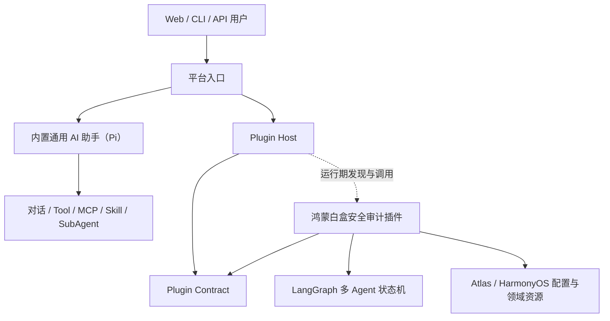
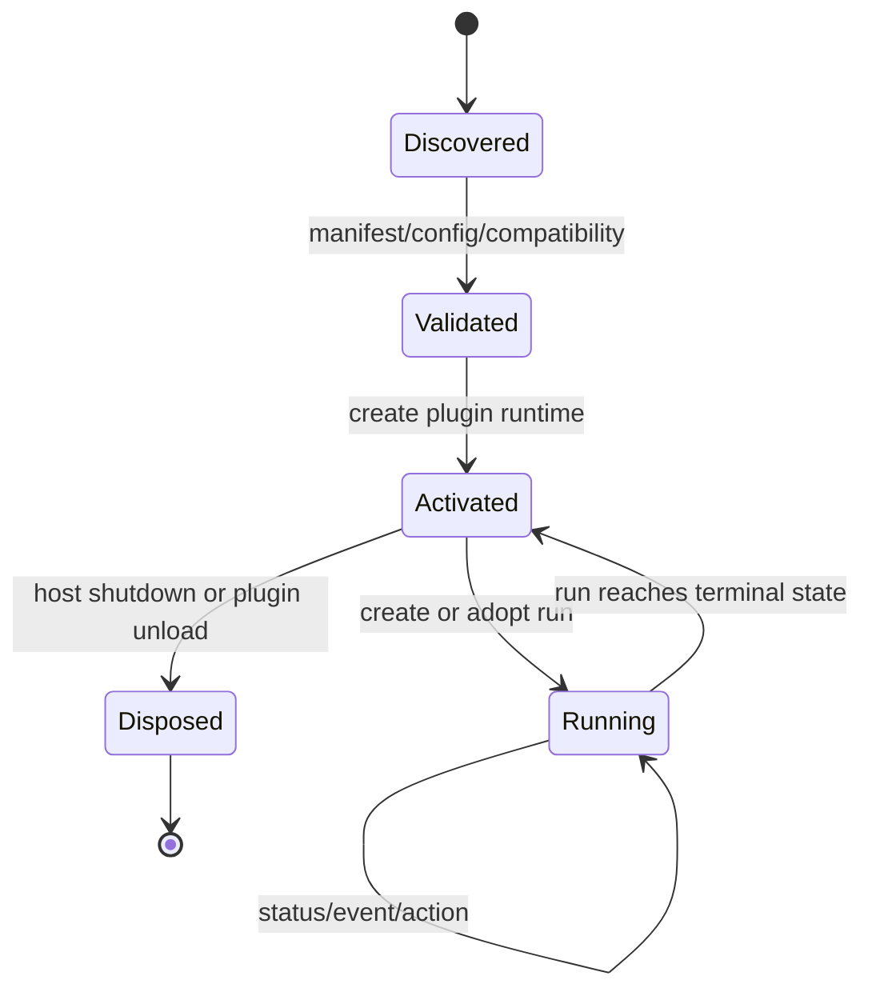

# 功能骨架与领域插件边界契约

状态：已冻结  
契约版本：`platform-plugin-boundary-v2`  
冻结日期：2026-08-03  
适用范围：v3.2 及后续功能骨架、所有领域插件、CLI、Server 与 Web

## 1. 目的

本系统的产品定义是：**一个通用 AI 助手，允许以插件方式增加基于 LangGraph 的自定义多 Agent 能力。**

系统在最高层划分为两个黑盒：

1. **通用 AI 助手（General AI Assistant）**：基于 Pi 提供对话、模型、工具、MCP、Skill、Session、SubAgent 和插件调用能力；即使不安装任何领域插件也可以独立使用。
2. **多 Agent 插件（Multi-Agent Plugin）**：以 LangGraph 定义自有状态机、Agent 分工、工具组合、恢复语义和领域交付能力。

当前唯一领域插件是“鸿蒙白盒安全审计插件”。本契约只冻结两者边界，不决定功能骨架最终选择 `pi-agent-core`、`pi-coding-agent` 或其他开源组件，也不修改已冻结的鸿蒙审计事实与验证契约。

## 2. 权威依赖方向



编译期依赖必须满足：

```text
apps/platform-host ──> platform contracts and runtime
platform runtime  ──> open-source infrastructure
domain plugin     ──> platform contracts and permitted open-source libraries

禁止：platform runtime ──> concrete domain plugin
禁止：domain plugin ──> platform application implementation
```

Host 可以在组合根通过配置或包发现加载插件，但不得在平台业务代码中静态依赖、实例化或按名称判断具体插件。

## 3. 功能骨架职责

功能骨架只拥有领域无关的机制：

| 类别 | 骨架可以拥有的能力 |
|---|---|
| 模型 | Provider 接入、模型注册、认证、模型选择接口 |
| Assistant | 面向用户的通用对话、会话历史、Steering、Follow-up 和插件调用 |
| Agent | 单 Agent 循环、消息、流式事件、Abort、通用 Session |
| Tool | 通用 Tool 接口、调用生命周期、基础安全策略 |
| MCP | Client/Transport、连接生命周期、通用超时和资源上限 |
| Skill | 发现、解析、安装、版本和显式激活接口 |
| SubAgent | 通用委派、隔离执行实例和领域无关的可配置并发机制 |
| Workflow | 图执行引擎、checkpoint 机制、interrupt/resume 原语 |
| Plugin | 安装、发现、Manifest 校验、激活、路由和卸载 |
| Platform Run | 通用 Job 引用、状态外壳、事件转发和 Artifact 访问 |
| Interface | 通用助手对话及 CLI/HTTP/Web 外壳、认证、授权和传输协议 |
| Operations | 配置加载、日志、Metric、Trace、秘密脱敏 |

骨架可以提供并发容量参数，但不得规定某个领域必须使用 5 槽、任务如何领取、何时重试或何时判定业务完成。

骨架可以提供 Graph/Checkpoint，但不得定义任何领域图的节点、边、任务派生规则或领域恢复语义。

## 4. 功能骨架禁止拥有的概念

功能骨架的合同、数据结构、路由、错误码、配置 Schema 和 UI 核心中不得出现下列领域概念：

- HarmonyOS、ArkTS、Ability、ExtensionAbility、HAP/HSP/HAR；
- Atlas、Atlas 索引、Atlas 工具名；
- Component、Entry Candidate、Capability；
- 路径发现、参数传播、Principal、权限传播；
- 六维验证、Operation Group、Evidence、Finding；
- Attack Matrix、审计覆盖缺口、鸿蒙审计报告；
- `component_semantic_analysis`、`exploitability_validation` 等领域任务类型；
- 固定的 5 槽审计策略；
- `run.db` 的鸿蒙审计事实表和领域状态迁移。

平台日志或不透明透传数据可以包含插件提供的文本，但平台不得解释、分支判断或持久化为平台自有业务字段。

## 5. 领域插件职责

领域插件必须完整拥有自身业务能力、LangGraph 多 Agent 编排和事实语义。鸿蒙白盒安全审计插件至少拥有：

| 类别 | 鸿蒙插件完整拥有的内容 |
|---|---|
| 项目模型 | HarmonyOS 配置解析、模块/组件/入口/权限/依赖建模 |
| 领域工具 | Atlas CLI、Atlas MCP 配置、setup call 和工具白名单 |
| 审计分析 | 路径发现、跨组件关联、参数/身份/权限传播 |
| 有效性判断 | 六维验证、反证、降级、DoS 等专项规则 |
| Agent 资源 | 审计 Task Schema、Result Schema、Skill 和 Prompt |
| 业务编排 | LangGraph 审计图拓扑、Agent 分工、任务派生、5 槽策略、重试和完成判定 |
| 事实存储 | `run.db` Schema、事务、不变量、稳定 ID 和恢复语义 |
| 交付产物 | Finding、Attack Matrix、JSON/Markdown/HTML 报告 |
| 插件界面 | 项目/组件/Capability 配置、Finding 与报告展示贡献 |

Atlas 虽通过 MCP 协议连接，仍然完全属于鸿蒙插件。骨架只知道它正在管理一个 MCP Session，不得知道 Server 是 Atlas，也不得内置 Atlas 工具白名单。

## 6. 骨架与插件的唯一交互面

骨架只允许通过领域无关的插件协议与插件交互。协议的概念模型冻结如下，具体 TypeScript 接口在后续设计中版本化：

| 协议对象 | 最小语义 | 领域数据处理方式 |
|---|---|---|
| `PluginManifest` | ID、版本、入口、兼容性和贡献类型 | 不包含平台需要解释的领域字段 |
| `PluginConfigSchema` | 插件配置的 Schema 和默认值 | 平台只校验和透传 |
| `RunRequest` | 插件 ID、请求负载、调用主体 | `payload` 对平台不透明 |
| `RunReference` | 平台 Job ID、插件 ID、插件 Run 引用 | 插件 Run 引用为不透明字符串 |
| `RunSnapshot` | 通用生命周期、时间、进度摘要 | `details` 对平台不透明 |
| `PluginEvent` | Run 引用、事件类型、时间和 payload | payload 只转发，不解释 |
| `RunAction` | cancel、resume、插件声明的扩展动作 | 平台鉴权后委托插件 |
| `Artifact` | ID、媒体类型、名称和访问句柄 | 内容由插件生成，平台负责授权传输 |
| `InterfaceContribution` | 配置表单、详情视图或静态资源入口 | 由插件提供，平台外壳装载 |

平台可以统一定义少量生命周期外壳：

```text
accepted -> preparing -> running -> terminal
```

插件负责把领域状态映射到外壳状态。平台不得据此推导审计是否完整、是否存在漏洞或是否需要人工复核。

## 7. 插件生命周期



生命周期规则：

1. **Discover**：Host 从配置或包系统发现插件入口。
2. **Validate**：校验 Manifest、平台兼容版本和配置 Schema。
3. **Activate**：注入模型、Agent Session、全局已启用 MCP/Skill、LangGraph、事件和日志等通用端口；插件可继承或缩小能力范围。
4. **Create/Adopt Run**：插件创建或接管领域 Run；领域数据库归插件所有。
5. **Observe/Act**：Host 只查询通用快照、转发事件和委托动作。
6. **Artifact**：Host 鉴权并传输插件声明的产物。
7. **Dispose**：插件释放 Session、MCP、后台任务和其他资源。

插件卸载不得要求修改 `packages/core`、通用 Server、通用 CLI 或 Web 外壳源码。

## 8. 数据和持久化所有权

| 数据 | 所有者 | 规则 |
|---|---|---|
| 模型凭据与通用 Session | 功能骨架或所复用的开源组件 | 插件只能通过受控端口使用 |
| 平台 Job 索引 | 功能骨架 | 只保存插件 ID、Run 引用和通用状态外壳 |
| Graph checkpoint | 提供图的插件负责语义，骨架可提供存储机制 | 不得成为领域事实源 |
| 领域 Run 数据库 | 领域插件 | Schema、迁移、事务和恢复均由插件负责 |
| 领域事件 payload | 领域插件 | 平台只做授权后的不透明传输 |
| 报告和其他 Artifact | 领域插件 | 平台不得重建或改写业务内容 |

鸿蒙插件的 `run.db`、`graph.db`、Project Model、Finding 和报告均不属于平台数据模型。

## 9. CLI、HTTP 与 Web 边界

通用界面提供：

- 通用助手对话、Session、消息流、Tool/MCP 调用状态和插件调用入口；
- 插件发现和选择；
- 通用 Run 创建、列表、状态、事件、动作和 Artifact 入口；
- 认证、授权、错误传输和通用导航；
- 插件贡献的配置与详情界面装载点。

`audit`、`components`、`capabilities` 等领域命令可以由鸿蒙插件贡献，但不得硬编码在通用 CLI。HarmonyOS 项目表单、5 槽视图、Finding、Attack Matrix 和报告预览可以由鸿蒙插件贡献，但不得成为通用 Web 外壳的数据模型。

## 10. 合规验收

后续重构完成时必须满足：

1. 删除或不安装鸿蒙插件后，通用助手仍可独立构建、启动并使用模型、Tool、MCP、Skill 和 Session。
2. `packages/core`、通用 Interface、Server、CLI 和 Web 外壳不得 import `@agent-platform/harmony-audit`。
3. 功能骨架不得包含第 4 节列出的领域名称判断、Schema 或路由。
4. 鸿蒙插件不得 import Server、CLI、Web 外壳或平台 Application Service 的实现。
5. 新增第二个 Dummy Plugin 不得修改功能骨架源码。
6. 插件 Run 的领域 payload 在平台往返后保持不变，平台不得解析后重写。
7. 平台只通过插件协议执行 create/status/events/actions/artifacts/dispose。
8. 依赖图检查和禁止 import 检查必须加入 CI。
9. 自定义多 Agent 领域插件必须通过 LangGraph 表达可恢复状态机；图节点、Agent 分工和领域 checkpoint 语义归插件所有。
10. 通用助手默认可使用用户全局启用的 MCP；插件可以继承或按任务缩小范围，平台不得硬编码 Atlas 等具体工具。

## 11. 版本与变更规则

- 本契约只冻结架构所有权，不替代 `audit-contract-v1`、`run.db schema v2` 和鸿蒙领域不变量。
- 插件协议的破坏性修改必须提升 `platform-plugin-boundary` 主版本。
- 某个领域插件增加内部任务、工具、状态或报告字段，不要求提升本契约版本。
- 平台开始解释新的领域字段，属于边界破坏，必须先修改本契约并说明必要性。

## 12. 当前实现状态

插件边界、CLI、Server、Web Contribution 和五槽策略归属已经完成反转。当前主要过渡点是：

- Pi Coding Agent 只完成兼容性验证，尚未接管生产 Session；
- Web 当前以插件工作台为主，尚缺通用助手对话页面；
- 自研模型调用与 Skill 解析尚待由 Pi 通用能力替换；
- Harmony 插件已使用 LangGraph，但通用合同还需要明确暴露 LangGraph 多 Agent 插件能力。
