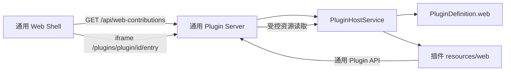

# Web Shell 与插件页面贡献

状态：已实现  
完成日期：2026-07-31

## 1. 结论

Web 已拆成两层：

| 层 | 位置 | 责任 |
|---|---|---|
| 通用 Web Shell | `apps/web/public` | Token、健康检查、Contribution 发现、导航、隔离装载 |
| Harmony Web Contribution | `packages/harmony-audit/resources/web` | 项目解析、审计配置、5 槽执行、Finding、覆盖缺口、报告预览 |

平台层没有 Harmony 文案、插件 ID 常量、组件/能力字段、五槽语义或报告 Artifact ID。安装其他插件时，只要插件声明 Web contribution，Shell 就能自动显示并加载，不需要修改 Web 或 Server 源码。

## 2. 装载流程

公开 contribution 只有 `pluginId`、`id`、`title` 和 `entry`。`assetsRoot` 只存在于服务端插件定义中。

## 3. 资源安全边界

`PluginHostService.openWebAsset()`：

1. 验证插件和 contribution 已注册；
2. 拒绝绝对路径、空路径、空片段和 `..`；
3. 对资源根和目标执行 `realpath`；
4. 验证目标仍是资源根的子文件，阻止符号链接逃逸；
5. 只返回文件字节，不向浏览器暴露真实文件系统路径。

HTML contribution 使用限制同源脚本、样式、连接、图片和 iframe 的 CSP，并禁止 MIME 嗅探。

## 4. 验收标准

- 删除 Harmony 插件后，通用 Web Shell 和 Server 仍可构建运行；
- 新插件页面通过合同自动出现在导航中；
- Shell 不读取 `snapshot.details`；
- Harmony 原有页面继续通过 Operation/Run/Action/Event/Artifact 通用 API 工作；
- 路径穿越和未知 contribution 被拒绝；
- Server 与 Interface 测试使用 Dummy Plugin，不依赖 Harmony 包。
