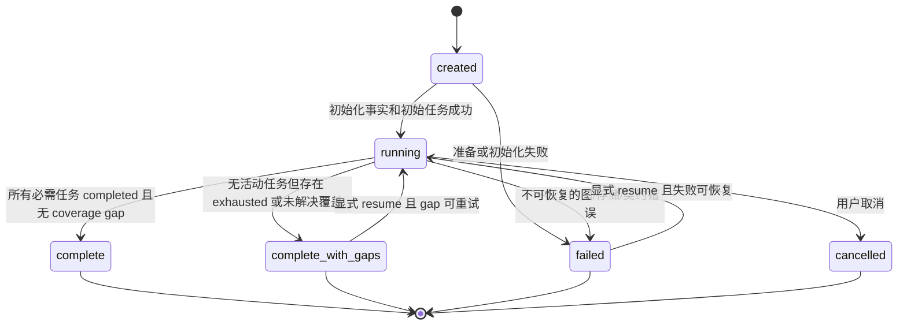
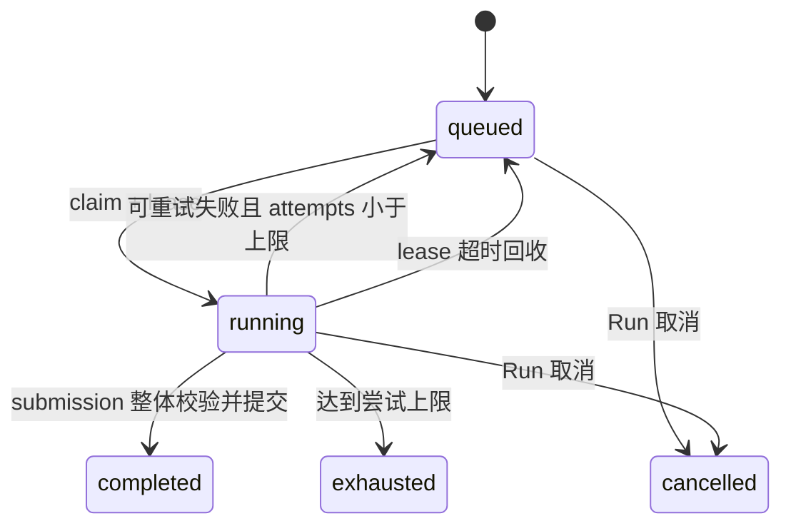

# 状态、不变量与测试契约

## 1. Run 状态机

终态写入规则：`complete` 和 `complete_with_gaps` 设置 `finalized_at`；`failed/cancelled` 不伪装为已完成报告。恢复必须产生事件并保留旧错误历史。

PoC 生成任务不是完成门禁：`poc_generation` 达到尝试上限（exhausted）不产生覆盖缺口、不阻塞 `complete`，仅在对应 Finding 的报告中显示「未生成 PoC」占位。

## 2. Task 状态机

`attempts` 只在 claim 时递增。过期 attempt 的结果必须以 `STALE_TASK_ATTEMPT` 忽略并记录事件，不能修改事实。

## 3. 稳定错误码

| 错误码 | 拒绝条件 |
|---|---|
| `TASK_NOT_RUNNING` | 任务不存在或不是 running |
| `STALE_TASK_ATTEMPT` | attempt 与当前租约不一致 |
| `TASK_ID_MISMATCH` | submission task_id 不等于当前 task |
| `ENTRY_ID_MISMATCH` | submission entry_id 不等于任务主体 |
| `DUPLICATE_LOCAL_ID` | 同一提交内 evidence/fact/call/group key 重复 |
| `UNKNOWN_EVIDENCE_REF` | 引用不存在或不属于允许证据集合 |
| `INVALID_FACT_EDGE` | Edge 端点缺失、自环或跨 group |
| `CAPABILITY_OUT_OF_SCOPE` | capability 不在 Run 审计范围 |
| `CAPABILITY_NOT_ENABLED` | capability 未启用 |
| `CAPABILITY_CATEGORY_MISMATCH` | capability 与 category 规则不匹配 |
| `UNKNOWN_TARGET_COMPONENT` | component call 目标不在 Project Model |
| `INVALID_PARAMETER_MAPPING` | 参数映射字段、序号或 control state 非法 |
| `MISSING_GROUP_VALIDATION` | 输入 group 没有 validation |
| `UNEXPECTED_GROUP_VALIDATION` | validation 引用了输入外 group |
| `DUPLICATE_GROUP_VALIDATION` | 同一 group 有多个 validation |
| `CONFIRMED_DIMENSIONS_INCOMPLETE` | confirmed 六维不全真 |
| `TRUE_DIMENSION_EVIDENCE_INSUFFICIENT` | 判真维度没有非假设证据 |
| `CONFIRMED_EFFECT_CHAIN_INCOMPLETE` | confirmed 缺少完整效果因果链 |
| `CONFIRMED_EFFECT_NOT_INDEPENDENTLY_VERIFIED` | 效果链没有本轮验证新增的源码证据 |
| `HYPOTHESIS_BASIS_MISSING` | 效果假设没有候选依据 |
| `DIRECT_EFFECT_EVIDENCE_MISSING` | 直接效果没有源码证据 |
| `CONFIRMED_DETAILS_INCOMPLETE` | confirmed 缺 impact/severity/CWE |
| `DEMOTION_REASON_MISSING` | 非 confirmed 缺降级理由 |
| `EVIDENCE_GAP_MISSING` | residual/insufficient 缺证据缺口 |
| `PROTECTION_OUTCOME_MISMATCH` | protected 但检查不为 effective |
| `DOS_SEMANTIC_MISMATCH` | DoS category/availability/影响条件不一致 |
| `PRINCIPAL_CHAIN_INCOMPLETE` | 跨主体链缺必要 principal analysis |
| `IDENTITY_COLLISION` | 稳定 ID 相同但规范内容不同 |
| `UNSUPPORTED_SCHEMA_VERSION` | 数据库或 Project Model 版本未知 |
| `ILLEGAL_STATE_TRANSITION` | 未在状态机中声明的状态迁移 |
| `FINDING_ID_MISMATCH` | PoC submission finding_id 不等于任务主体 |
| `POC_ENTRY_TYPE_MISMATCH` | PoC entry_type 不在入口允许集合 |
| `POC_CODE_REQUIRED` | PoC 缺少可执行代码 |
| `POC_EXPECTED_OBSERVATION_REQUIRED` | PoC 缺少预期现象 |
| `POC_TRIGGER_KIND_REQUIRED` | PoC 缺少触发方式 |
| `POC_TRIGGER_PAYLOAD_REQUIRED` | PoC 缺少触发载荷 |
| `POC_TRIGGER_PAYLOAD_EMPTY` | 触发载荷为空对象 |
| `POC_PLACEHOLDER_FOUND` | 代码包含“略/省略/…”等占位符 |
| `POC_FORBIDDEN_OUTPUT` | 输出验证阶段的判断性字段（classification/severity/cwe/impact 等） |
| `POC_SHELL_COMMAND_REQUIRED` | 声明 shell 形态但代码不是可执行命令 |
| `POC_SHELL_TRIGGER_MISMATCH` | shell 形态搭配非命令类触发方式 |
| `POC_ARKTS_TRIGGER_MISMATCH` | arkts 形态搭配 `adb_shell` 触发 |
| `POC_ARKTS_API_REQUIRED` | arkts 代码缺少真实触发 API |

Schema 校验错误使用 `SCHEMA_INVALID`，并附 AJV 路径；以上错误发生在 Schema 通过之后。

## 4. P0 不变量与测试目录

每个规则至少实现下列正反测试。测试名是后续实现的稳定追踪 ID。

| 规则 | 正例测试 | 反例测试 |
|---|---|---|
| 当前任务上下文一致 | `INV-CTX-001 accepts matching task entry attempt` | `INV-CTX-002 rejects task entry and stale attempt mismatch` |
| Evidence 唯一且引用存在 | `INV-EV-001 accepts local and inherited evidence` | `INV-EV-002 rejects duplicate unknown and foreign evidence` |
| Fact Edge 只连接本 group 节点 | `INV-GRAPH-001 accepts valid directed fact chain` | `INV-GRAPH-002 rejects missing cross-group and self endpoints` |
| capability 已启用且在范围内 | `INV-CAP-001 accepts scoped enabled capability` | `INV-CAP-002 rejects planned unknown and out-of-scope capability` |
| capability/category/专项字段匹配 | `INV-CAP-003 accepts registered category semantics` | `INV-CAP-004 rejects category and DoS mismatch` |
| 每个输入 group 恰有一个 validation | `INV-VAL-001 accepts bijective validation set` | `INV-VAL-002 rejects missing duplicate and extra validation` |
| confirmed 六维与详情完整 | `INV-VAL-003 accepts fully confirmed result` | `INV-VAL-004 rejects false dimension or missing details` |
| 推断不能升级为事实或确认结论 | `INV-EFFECT-001 accepts explicit hypothesis with gaps` | `INV-EFFECT-002 rejects effect fact, hypothesis-backed true dimension and inherited-only effect chain` |
| 非漏洞降级信息完整 | `INV-VAL-005 accepts protected benign residual insufficient` | `INV-VAL-006 rejects missing reason gap or counter evidence` |
| 跨组件 Call 目标与参数合法 | `INV-CALL-001 accepts known target mappings` | `INV-CALL-002 rejects unknown target duplicate ordinal and invalid state` |
| 跨组件主体/权限链完整 | `INV-PRINCIPAL-001 accepts preserved and delegated identity` | `INV-PRINCIPAL-002 rejects incomplete identity reset chain` |
| 事务原子性 | `INV-TX-001 commits complete normalized submission` | `INV-TX-002 leaves database unchanged after any rejection` |
| 幂等性 | `INV-IDEM-001 replays accepted submission without duplicates` | `INV-IDEM-002 rejects same identity with divergent content` |
| exhausted 影响 Run 状态 | `INV-RUN-001 completes gap-free run` | `INV-RUN-002 marks exhausted run complete_with_gaps` |
| 报告只依赖规范事实 | `INV-REPORT-001 rebuilds identical report without graph db` | `INV-REPORT-002 exposes orphan or migration gaps` |
| PoC 引用与形态一致性 | `INV-POC-001 accepts structured artifact with bound evidence` | `INV-POC-002 rejects placeholder forbidden fields and form mismatch` |
| PoC 非门禁 | `INV-POC-003 completes the run without a poc artifact` | — |

## 5. 专项领域规则

### DoS

`CAP-DOS-001` 的 operation group 必须是 `category=availability` 并含 availability；confirmed 时必须同时满足：外部触发或可重复、致命失败或放大消耗、无有效隔离、实质可用性损失。仅证明 SQL、文件或 Web 风险不能确认 DoS。

### 主体与委托

跨组件 group 必须能区分 origin principal、immediate caller、callee observed principal 和 authority used。发生身份重置或下游只能看到中间组件身份时，必须记录 origin binding；若安全检查只验证 immediate caller，不得自动视为约束 origin。

### 权限

权限检查只有在操作前支配目标路径、校验同一主体/属性且失败分支阻止操作时才有效。Manifest 声明权限不能替代源码路径上的事实关联。

### Finding

只有 accepted `confirmed_vulnerability` Validation 可以形成 Finding。Finding ID 根据 root cause key 生成；标题文本变化不得产生新 Finding。多个路径属于同一根因时通过 `finding_causes` 归并。
