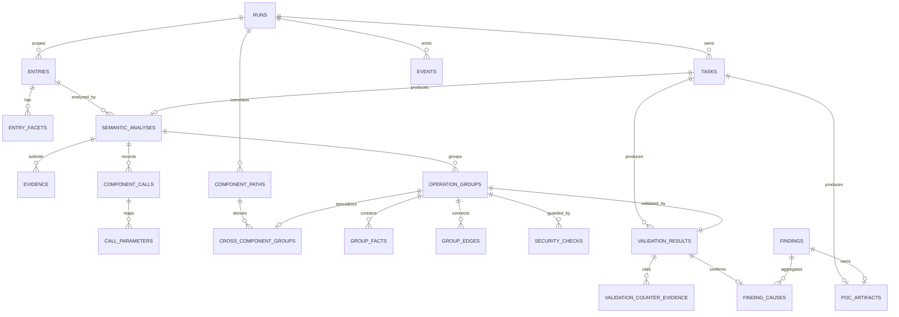

# run.db schema v2 契约

## 1. 实体关系



## 2. 表契约

所有时间为 UTC ISO-8601；所有 JSON 字段保存 canonical JSON；所有外键开启并在事务提交时检查。

### 控制表

| 表 | 主键 | 必要字段与约束 |
|---|---|---|
| `schema_meta` | `version` | 单行；`version=3`，含 `contract_version`、`migrated_at` |
| `runs` | `run_id` | `status` 受枚举约束；记录 Project Model 版本、范围快照、恢复代次、错误和完成时间 |
| `tasks` | `task_id` | `(run_id, semantic_key)` 唯一；`kind` 枚举 `component_semantic_analysis`/`exploitability_validation`/`poc_generation`；status 枚举；attempts 非负；租约字段成组出现 |
| `events` | `event_id` | `run_id` 外键；事件类型、主体、无秘密 payload、时间 |

### 项目和入口事实

| 表 | 主键 | 外键/唯一约束 |
|---|---|---|
| `entries` | `entry_id` | `run_id`；`component_id`；`(run_id, candidate_key)` 唯一 |
| `entry_facets` | `facet_id` | `entry_id`；`(entry_id, facet_type, payload_sha256)` 唯一 |

模块和组件完整对象保存在版本化 `project-model.json`；数据库保存审计所需入口投影。P1 可增加模块/组件镜像表，但不得改变 Entry 的身份。

### 语义事实

| 表 | 主键 | 外键/唯一约束 |
|---|---|---|
| `semantic_analyses` | `semantic_analysis_id` | `task_id` 唯一；`entry_id`；accepted attempt；summary/coverage |
| `evidence` | `evidence_id` | `run_id`、`producer_task_id`；内容哈希；同任务来源键唯一 |
| `component_calls` | `component_call_id` | `semantic_analysis_id`；`(semantic_analysis_id, call_key)` 唯一；目标组件必须存在 |
| `call_parameters` | `(component_call_id, ordinal)` | source/target property、control state、transform |
| `component_paths` | `path_id` | `run_id`；root/target entry；fingerprint 在 Run 内唯一；循环标记与路径上下文 |
| `operation_groups` | `group_id` | `semantic_analysis_id`；`(semantic_analysis_id, group_key)` 唯一；capability/category |
| `cross_component_groups` | `group_id` | `path_id`、`local_group_id`；每条路径与局部 Group 组合唯一 |
| `group_facts` | `(group_id, fact_key)` | fact type/body/location |
| `group_edges` | `(group_id, from_fact_key, to_fact_key, kind)` | 两端必须属于同一 group |
| `security_checks` | `security_check_id` | 所属 group 或 call 二选一；subject kind、validated property、behavior |

Operation Group 的 `payload_json` 将源码事实与效果假设分开保存：事实链不允许 `effect` 类型；直接观察效果写入 `context.direct_observed_effect`，未验证推断写入带缺失证明项的 `context.effect_hypotheses`。Validation 的六维字段采用三态结构，并为确认漏洞保存独立核验的 `effect_chain`。

证据引用使用关联表，不在规范化实体中保存 JSON ID 数组：

```text
semantic_evidence
call_evidence
group_evidence
fact_evidence
edge_evidence
security_check_evidence
validation_evidence
counter_evidence_refs
```

每张关联表使用复合主键，Evidence 必须属于同一 run。

### 验证与 Finding

| 表 | 主键 | 外键/唯一约束 |
|---|---|---|
| `validation_results` | `validation_id` | `group_id` 唯一；`task_id`；分类、六维、边界、主体、DoS 专项字段 |
| `validation_counter_evidence` | `counter_evidence_id` | `validation_id`；kind/reason |
| `findings` | `finding_id` | `(run_id, root_cause_key)` 唯一；title/severity/CWE/impact |
| `finding_causes` | `(finding_id, validation_id)` | validation 必须是 confirmed；一个 validation 最多属于一个 Finding |
| `poc_artifacts` | `poc_id` | `finding_id` 唯一；`run_id`；`producer_task_id`；entry_type；payload_json |

`findings` 只能由 Finding Builder 生成。Agent 提交中不得接受 `finding_id` 或根因归并结果。PoC 工件由 `poc_generation` 任务独立产出，一个 Finding 至多一个 Artifact（`finding_id` 唯一）；`findings` 表不含 PoC 字段，报告层通过 `poc_artifacts` 关联渲染。

## 3. 事务边界

### Semantic 提交

单事务完成：

1. 锁定并核对 running task 和 attempt。
2. 执行全部上下文及领域校验。
3. 写 Semantic Analysis、Evidence、Call、Group、Fact、Edge、Check。
4. 合并跨组件关联输入并创建/更新下游任务。
5. 为存在 operation group 的分析按一组一任务创建 Validation Task；任一组失败不得回滚或拒绝其他组。
6. 将当前任务置为 completed，追加事件。

任一步失败必须整体回滚；不得先完成任务再写事实。

### Validation 提交

单事务完成：

1. 核对 task、attempt 和输入 group 集合。
2. 校验每个 group 恰有一个 validation。
3. 写 Validation、Evidence、Counter Evidence。
4. Finding Builder 重算受影响 root cause 并 upsert 确定性 Finding。
5. 将任务置为 completed，追加事件。

### Finalize

只读事实构建报告成功后，才在短事务中写最终状态和 `finalized_at`。报告写入应采用临时文件加原子替换；失败时 Run 保持可恢复状态。

## 4. v1 → v2 迁移规则

1. 对原 `run.db` 创建同目录备份 `run.db.v1.bak`；已存在则拒绝覆盖。
2. `BEGIN IMMEDIATE`，检查 v1 表和 `schema_meta=1`。
3. 创建带 `_v2` 后缀的新表和所有约束。
4. 迁移 runs/tasks/events；`input_json/result_json/payload_json` 保留为 legacy snapshot。
5. 对已完成任务重新执行离线 ingest；不能规范化的记录标记 migration gap，不得伪造事实。
6. 校验外键、行数、唯一性和 Finding 可追溯性。
7. 原子切换表名，写 `schema_meta=2` 和 `audit-contract-v1` 后提交。
8. 任一校验失败则回滚，原数据库保持 v1 可读。

迁移是幂等的：v2 再次执行返回 `already_current`；未知版本返回 `UNSUPPORTED_SCHEMA_VERSION`。

从 v1 JSON 无法可靠恢复的 Evidence 哈希、跨组件主体传播和根因映射必须记录为明确 gap，最终 Run 不得被标为普通 `complete`。

## 5. 数据保留与秘密

- 禁止保存 API Key、完整进程环境或 Authorization Header。
- Atlas 大输出不直接写事件；只保存必要摘录、位置、哈希和内容引用。
- 原始 Agent submission 可留存以便审计，但必须经过秘密字段拒绝/脱敏检查。
- `graph.db` 可删除；删除后不得损失任何审计事实。
