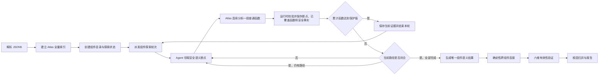

# AI 渐进式组件语义探索方案

> 状态：已完成。探索状态、Agent 多轮协议、五种审计模式、最终语义生成、报告可视化和自动化回归均已接入正式流程。
>
> 本方案替换“脚本预先展开完整函数图，再按固定函数数量派发语义批次”的上一版设计。项目准备、跨组件连接、六维有效性验证、根因归并、PoC 和报告主流程保持不变。

| 阶段 | 状态 |
|---|---|
| 1. 探索状态基础：数据库、状态机、CLI、步骤/轮次契约 | 已完成 |
| 2. 从探索数据生成组件语义结果 | 已完成 |
| 3. Agent 与多轮调度切换 | 已完成 |
| 4. 全量、能力、组件、增量和恢复模式接入 | 已完成 |
| 5. 探索过程可视化 | 已完成 |
| 6. 旧协议清理与自动化回归 | 已完成 |

## 1. 目标

1. 组件语义 Agent 直接使用 Atlas MCP 渐进式阅读源码，由 AI 根据真实语义决定后续探索方向。
2. 一个 Ability/ExtensionAbility 保持为一个逻辑分析单元，但允许运行时拆成多轮短任务，避免单个子任务上下文无限增长。
3. 探索节点、调用关系、停止原因和覆盖缺口持续写入 `run.db`，支持中断续跑和过程可视化。
4. 不使用固定调用深度作为正常终止条件。组件只有在所有已发现分支均得到处理后才能完成。
5. 对系统 API、普通第三方依赖、跨组件调用、循环和无安全影响分支设置明确边界，避免进入无关实现持续消耗资源。
6. 保持 Agent 不直接操作数据库、中央任务状态和报告；所有状态变更必须经过审计运行时校验。

## 2. 非目标

- 不重新实现 Atlas 的符号、调用图、路径或数据追踪能力。
- 不恢复 Entry 与 Sink 笛卡尔组合或预设攻击矩阵驱动的路径生成。
- 不为每个函数、每条调用边或每条完整路径创建独立任务。
- 不修改六维有效性验证规则、跨组件连接算法和 Finding 根因归并模型。
- 不在本阶段增加 Native/NAPI 分析。

## 3. 总体流程



初始化阶段只负责 JSON5 项目建模、Atlas 索引、组件目录和探索状态创建，不预先生成组件完整函数图。

## 4. 逻辑分析单元与物理任务

### 4.1 逻辑单元

每个 Manifest Ability/ExtensionAbility 对应一个 `component_exploration`。它保存该组件从入口确认到全部分支闭合的完整状态。

### 4.2 物理任务

同一组件只有一个持久的 `component_semantic_analysis` 任务记录，但可以被连续派发多个执行轮次：

- 一轮优先走完当前路径；短路径闭合后继续分析下一条待处理路径。
- 每轮默认最多累计覆盖 64 个函数，每次分段提交最多内联分析 8 个普通目标函数。
- 同一组件最多存在一个 queued/running 语义任务。
- 不同组件继续使用现有 5 槽并发池。
- 当前轮完成但仍有待分析节点时，运行时将原任务重新排队并清零本轮重试次数。
- 下一轮只加载当前节点所需的最小安全上下文，不加载之前全部 Atlas 输出和完整对话。
- 单组件最多保留 64 个可执行断点并连续执行 8 轮；超出部分转为 `resource_limit` 覆盖缺口。

轮次函数保护只切换 Agent 上下文：已有证据保留，未完路径在下一轮继续，不标记为覆盖缺口。组件断点总数和总轮数则是最终异常保护；达到这类上限时结果才标记为 `partial`。

## 5. Agent 与运行时交互

语义 Agent 直接调用 Atlas MCP 的 `search`、`symbol`、`calls`、`explore`、`path` 和 `trace`。Atlas 是首选索引，但动态调用边缺失时，Agent 可以围绕当前调用点和对应的绑定、赋值、注册或覆写点直接核实源码。Python 运行时不读取 `.atlas/atlas.db`，也不自行推断调用关系。

任务文件为 Agent 提供绝对运行时路径、`run_dir`、`task_id`、`attempt`、步骤临时文件和以下命令模板：

```bash
python3 "<audit_orchestrator>" explore-next "<run_dir>" --task-id "<task_id>" --attempt <attempt>
python3 "<audit_orchestrator>" explore-record "<run_dir>" --task-id "<task_id>" --attempt <attempt> --input "<step_file>"
python3 "<audit_orchestrator>" explore-finish "<run_dir>" --task-id "<task_id>" --attempt <attempt>
```

### 5.1 `explore-next`

在一个事务中领取下一个安全语义断点。返回内容包括：

- `work_type`：`entry_discovery` 或 `function_analysis`；
- 当前节点、函数符号、文件位置和 Atlas 查询起点；
- 攻击者仍可控制的属性；
- 当前调用者和原始调用者关系；
- 沿途会改变安全结论的安全检查；
- 到达当前节点的最小必要路径；
- 本轮已处理断点数、累计函数和函数保护值；
- 返回的工作是当前路径的继续，还是一条新的待分析路径；
- 步骤结果 Schema 与临时文件路径。

节点领取状态与 `task_id + attempt` 绑定，其他任务不能提交该节点结果。

### 5.2 `explore-record`

Agent 使用 Atlas 和必要的受限源码核实完成当前节点分析后写入步骤文件。步骤至少包含：

- 当前分段的事实摘要和独立的暂停请求；
- 当前函数未完时的 resume：准确源码位置、剩余工作和安全状态；已完时显式为 null；
- Atlas 查询类型、源符号、已观察目标符号和未解析调用；
- 每个已接受关系的目标、关系类型、解析来源和证据；函数关系的源码补全必须同时包含调用点与绑定/分派点，入口关系则包含候选触发依据与 callback 实现；
- 已在当前步骤内完整分析、不需要独立断点的普通函数；
- 直接源码事实和证据位置；
- 分支、参数转换、身份变化和安全检查；
- 敏感操作组；
- 跨组件调用；
- 每个已知后续目标及正常停止原因，null 表示继续，不另填 decision；
- 传递给后续节点的结构化安全状态；
- 当前分段的结构化覆盖缺口，每项一次性包含 target、reason、evidence。

运行时先执行 JSON Schema、任务所有权、证据引用、组件范围、目标组件和操作组约束校验，再在一个事务中写入节点和连接。校验失败不结束整个物理任务，Agent 可以根据错误修改步骤文件后再次提交。

Agent 不填写步骤 status。需要换新上下文时设置 `pause_requested=true`，同时保存新发现的已知待分析目标；已经排队的兄弟分支不必重复声明。没有剩余待办时，脚本直接完成组件，不为暂停制造空轮次。已知未读代码只能作为后续目标，不能写成解析失败；Agent 不允许输出 `resource_limit`。

其他函数的待办放入 successors；当前函数内部未完时必须使用 resume，而不是自指 successor 或仅写一段暂停说明。resume 包含下一条未检查语句/分支的 `location`、描述已完成范围与剩余工作的 `remaining_work`、当前位置的 `state`。脚本创建同一函数的续跑节点，原函数定义位置不变；next 通过 `work.resume_from` 返回位置和剩余工作。续跑节点与普通函数复用、递归回边分别识别，不能把已经处理过的续跑位置再次声明为新进度。

每步必须显式填写 resume；null 表示当前范围已检查完，其他未处理去向均已登记为 successors 或真实 gaps，不是“未说明”。因此节点 completed 只覆盖已提交分段，组件是否完成还必须检查所有续跑分段。中断分段内的证据继续保留，未完成的函数不计入最终已覆盖函数数量。

入口发现必须填写 entry_assessment，后续步骤只有获得新证据、需要更新组件判断时才再次填写，并附有定位的 evidence。脚本更新同一份组件入口状态，每次 next 返回最新判断；不得用单个分支结论覆盖组件整体，也不得忘记其他已确认候选。初始 uncertain 可以随分析收敛，不被固定为最终结果。

每个维度只有一个输入：正常终止原因写 stop_reason，缺口和证据只写 gaps，换上下文只写 pause_requested。正常返回、失败分支、其他待办和暂停请求可以同时存在，不用互斥状态替代事实。删除 gap 类型事实及 unresolved 停止原因，避免重复声明。

查询的 `unresolved_targets` 是 Atlas 观察，步骤的 `gaps` 才是最终覆盖缺口。每个未解析表达式必须被源码关系的 `unresolved_ref` 补全，或原样进入 `gaps[].target` 并在该项附失败原因及定位证据。未知目标不伪造 successor。record 成功统一返回 `node_status=completed`，只表示分段处理并保存，不表示覆盖完整或任务完成。

### 5.3 `explore-finish`

当 next 返回 `round_complete=true` 时调用，包括本轮函数保护触发、已保存暂停请求或已无待分析节点。finish 在当前子 Agent 内立即根据数据库状态接续轮次或完成组件，不等待整批结束：

- 仍有待分析节点：直接返回 `task_status=queued`，重新排队同一 task_id；
- 所有节点闭合：生成唯一组件语义结果并返回 `task_status=completed`；
- 组件总工作量保护触发：仅由脚本以 `resource_limit` 关闭剩余节点并标记缺口；
- 已成功记录的节点不回滚，下一轮保留事实、安全状态和暂停摘要。

编排者在整批返回后调用 `reconcile-batch`，只回收仍停在 running 的中止任务。正常暂停已经由 finish 进入 queued，不属于失败重试。

## 6. 深度优先与状态去重

持久节点不再等同于“一个函数”，而是一个需要独立保留安全上下文的位置。普通 helper、继承实现、`super` 和没有安全语义变化的连续调用，由 Agent 在当前步骤内继续分析并记录为已覆盖函数。只有以下情况创建后续断点：

- 攻击者可控数据、调用主体或已经过的安全检查发生变化；
- 分支会改变后续安全判断；
- 到达已确认的组件、平台等边界；无法解析的表达式只记录缺口，不创建虚构节点；
- 当前步骤函数容量已用完，仍有待分析的项目函数。

待分析节点按以下顺序领取：

1. 上一个已落盘断点存在未分析后续时，优先继续该路径；
2. 当前路径闭合后，再从全局待处理集合中领取更深、更近发现的分支；
3. 累计函数达到保护值时，当前后续节点留在队列中，下一轮继续；
4. 同一组件内串行领取，不同组件之间仍可并行。

Agent 遇到多个调用或分支时必须全部记录。运行时将所有需要继续的目标加入待分析集合，当前轮随后领取最深、最新的目标，其余分支保留到后续处理。

节点唯一身份由运行时计算：

```text
组件 ID
+ 规范化函数符号
+ 续跑源码位置（普通函数起点为空）
+ 攻击者可控属性及其控制状态
+ 原始调用者与直接调用者关系
+ 已经过的安全检查身份
+ 当前组件身份
```

原始条件文本、循环次数、普通变量值和无关业务分支不进入身份。相同函数、相同安全状态和相同续跑位置只分析一次；相同函数在“经过校验”和“未经过校验”等不同安全状态下分别保留。续跑说明不参与身份，源码位置参与，避免改写描述制造重复任务。

已经提交分析结果的节点始终为 completed，其他分支再次到达时复用，包括已正常返回或包含真实缺口的分段。stopped 仅表示未展开的已知边界，可被新关系重新打开；gap 仅表示脚本总量保护截断的未处理目标，不重新排队。避免把“已分析结束”和“尚未展开”混在同一处理状态中。

安全检查引用由源码位置、`subject_kind` 和 `validated_property` 组成，随 `state.security_checks` 传递。脚本生成稳定身份；Agent 不生成检查 ID。新增引用须对应本步骤有证据的检查，继承引用取自当前节点安全状态。描述措辞不参与节点去重，源码属性保持大小写。控制性和身份枚举的互斥取值顺序直接定义在 Agent 提示词与对应 Schema 中，不另建规则文件。运行数据版本升级为 24，旧格式的未完成探索需新建审计，不隐式迁移。

## 7. 探索终止条件

| 场景 | 处理方式 |
|---|---|
| 函数正常返回、确定抛出且没有后续执行 | 当前分支结束 |
| 到达另一个 Manifest 组件 | 记录 `component_call`，当前组件内停止 |
| 已确认的系统 API、平台 API | 记录平台边界，不进入内部实现；项目源码缺失不自动视为平台边界 |
| 工作区内 HAP/HSP/HAR 或源码依赖 | 按实际调用继续分析 |
| 普通第三方依赖 | 先分析当前边界函数；没有安全语义变化则停止 |
| 第三方代码包含身份变化、安全检查、敏感操作、项目回调或改变攻击者控制关系 | 继续深入对应实现 |
| 相同函数、相同安全状态与相同续跑位置已经存在 | 普通调用连接复用已有节点；续跑请求不能回到已处理位置 |
| 攻击者的数据、调用控制和身份影响均已终止 | 记录依据后结束当前分支 |
| Atlas 无法解析动态目标，但源码能够证明调用点与绑定/分派点 | 保存源码关系证据并继续分析 |
| Atlas 与受限源码核实都无法解析目标 | 写入步骤 `gaps`，由脚本汇总最终覆盖缺口，不要求虚构目标节点 |
| 发现敏感操作 | 记录操作但不停止，继续寻找后续安全检查和敏感操作 |

“成熟 SDK”不通过包名白名单判断，而根据源码归属和边界函数的实际安全语义判断。这样既不会深入普通框架内部，也不会因为第三方包名漏掉项目实际依赖的安全逻辑。

正常完成不依赖固定深度限制。可以保留可配置的运行级总状态预算作为异常保护；达到预算时必须将组件标记为 `partial` 并报告覆盖缺口，禁止据此输出“没有漏洞”。

## 8. 数据库设计

### 8.1 `component_explorations`

一行对应一个组件逻辑探索：

- `exploration_id`；
- `entry_id`，唯一；
- `status`：`pending/running/complete/partial`；
- 入口与外部入口判断；
- 已确认外部候选；
- 组件功能摘要；
- 当前轮次；
- 创建和更新时间。

节点数量等统计通过查询派生，不重复存储。

### 8.2 `exploration_nodes`

保存安全语义断点：

- `node_id`、`exploration_id`；
- 规范化函数符号、文件和位置；
- `state_key` 和结构化安全状态；
- 深度与发现顺序；
- 脚本维护的 `status`：queued 待处理，leased 处理中，completed 已提交分析，stopped 未展开边界，gap 总量保护截断；
- `resume_json`：当前节点的续跑位置和剩余工作；普通函数起点为空。安全状态仍保存在原 state_json，不重复维护；
- 当前租约的 `task_id` 和 `attempt`；
- 停止原因；
- Atlas 观察、当前分段已覆盖函数、源码事实、操作组、跨组件调用和覆盖缺口；
- 创建和更新时间。

唯一约束为 `exploration_id + symbol_key + state_key`。

### 8.3 `exploration_edges`

保存节点间关系：

- `edge_id`、`exploration_id`；
- 来源和目标节点；
- 类型：调用、回调、异步继续、分支、参数传播或组件边界；
- 分支条件、参数映射和身份变化；
- 脚本由目标 stop_reason 派生的继续/停止结果及原始证据；
- 创建时间。

数据库不保存重复的完整路径。报告和最终语义结果从节点与连接关系按需还原。

## 9. 组件语义结果生成

新增确定性 `semantic_results.py`，从全部闭合节点生成现有下游所需的组件语义结果：

1. 汇总首轮确认的入口状态；
2. 汇总已检查入口、操作位置和未解析目标；
3. 从节点观察中收集完整 Operation Group；
4. 使用现有安全身份去重等价操作组；
5. 汇总并去重跨组件调用；
6. 生成覆盖摘要；
7. 通过 `component-semantic-result.schema.json` 和现有业务不变量；
8. 落盘 `semantic_analyses`、`operation_groups`、`component_calls`、事实和证据。

最终组件结果由脚本生成，不要求 Agent 在长时间探索结束后重新拼装全部历史信息。六维验证只读取最终组件语义结果，不读取探索过程中的未完成草稿。

## 10. 可视化

`report.html` 保持用户手动刷新，不增加自动刷新。运行中即可展示：

- 每个组件的待分析、分析中、已完成、已停止和缺口断点数量；
- 当前断点、每段覆盖函数和已完成轮次；
- 从入口展开的调用树；
- 安全检查、敏感操作和跨组件调用位置；
- 每个分支继续或停止的原因；
- 组件是否真正闭合，或因证据/资源限制保持 partial。

新增导出 `exports/exploration_graph.json`。HTML 将共享节点投影成可折叠树，同一共享函数只保留一个真实节点，避免报告数据随完整路径数量膨胀。

## 11. 增量、组件和能力模式

- 全量模式：为全部 Manifest 组件创建探索状态。
- 能力模式：仍探索全部组件，能力范围只影响安全相关操作优先级和准入。
- 组件模式：只创建指定起始组件；真实跨组件调用证明下游可控后，再创建目标组件探索状态。
- 增量模式：受影响组件重新探索；未受影响组件继续复用最终组件语义结果，不复用未完成探索节点。
- 恢复模式：保留全部已完成节点，释放失败 attempt 的租约，从待分析节点继续。

最终组件语义契约和 Agent 提示词变化后，增量契约哈希必须变化。升级后需要先执行一次新的完整审计建立基线。

## 12. 文件变更计划

### 12.1 新增

| 文件 | 职责 |
|---|---|
| `resources/skills/audit-orchestration/scripts/audit_runtime/semantic_exploration.py` | 探索状态、节点领取、步骤提交、深度优先、去重、租约和轮次接续 |
| `resources/skills/audit-orchestration/scripts/audit_runtime/semantic_results.py` | 从探索数据生成、校验和落盘最终组件语义结果 |
| `resources/skills/audit-orchestration/config/schemas/component-exploration-step.schema.json` | 单个安全语义分段步骤契约 |
| `resources/skills/audit-orchestration/config/schemas/component-exploration-round.schema.json` | 脚本生成的轮次完成契约 |
| `tests/test_component_exploration.py` | 渐进探索、任务接续、去重、恢复和收口测试 |

### 12.2 删除

| 文件 | 原因 |
|---|---|
| `resources/skills/audit-orchestration/scripts/audit_runtime/atlas_graph.py` | 不再直接读取 Atlas SQLite |
| `resources/skills/audit-orchestration/scripts/audit_runtime/component_coverage.py` | 不再预生成完整函数图和固定批次 |
| `tests/test_component_coverage.py` | 被渐进探索测试替代 |

以上三个文件属于已取消的上一版设计，当前工作区已经删除。

### 12.3 修改

| 文件 | 修改内容 |
|---|---|
| `audit_runtime/store.py` | 增加三张探索表，删除分片表设计并升级 Schema |
| `audit_runtime/cli.py` | 增加 `explore-next/record/finish` |
| `audit_runtime/lifecycle.py` | 创建探索状态；调整增量语义复用入口 |
| `audit_runtime/initialization.py` | 初始化后直接返回组件探索任务，不执行静态覆盖规划 |
| `audit_runtime/scheduler.py` | 同组件单任务、轮次接续、租约释放和五槽调度 |
| `audit_runtime/commands.py` | 轮次提交后决定继续或生成最终组件结果 |
| `audit_runtime/contracts.py` | 增加步骤和轮次校验；保留最终组件与六维契约 |
| `audit_runtime/task_context.py` | 提供探索命令和最小上下文，移除固定批次字段 |
| `audit_runtime/correlation.py` | 下游组件扩展时创建探索状态 |
| `audit_runtime/incremental.py` | 从数据库重建语义快照，并更新契约哈希范围 |
| `audit_runtime/reporting.py` | 增加探索进度、调用树和探索图导出 |
| `component-semantic-result.schema.json` | 移除固定批次字段，增加最终探索覆盖摘要 |
| `resources/agents/component-semantic-analyzer.md` | 改为 Atlas MCP 渐进探索协议 |
| `resources/agents/harmony-auditor.md` | 保持批次编排，明确语义子任务内部使用受控探索命令 |
| `resources/commands/audit.md` | 将“一次组件任务”改为“一个逻辑探索、多轮接续” |
| `resources/skills/audit-orchestration/SKILL.md` | 记录新增命令和运行时职责 |
| `resources/skills/audit-workflow/SKILL.md` | 更新组件探索、停止条件和语义结果边界 |
| `resources/skills/project-modeling/SKILL.md` | 组件候选初始化为探索单元，不描述固定函数批次 |
| `deploy.py` | 部署新文件和 Schema；为语义 Agent 提供受控运行时命令，不增加 Bash 全局禁用 |
| `DESIGN.md`、`README.md` | 将静态函数图方案替换为渐进式探索架构 |
| `tests/test_flow_runtime.py` | 更新端到端任务生命周期与报告准入测试 |
| `tests/test_incremental_runtime.py` | 验证探索完成结果的基线复用与契约失效 |
| `tests/test_deploy.py` | 验证新增运行时、Schema 和 Agent 权限 |

### 12.4 保持不变

- `project_profiler.py` 与 `atlas_indexer.py`；
- Atlas MCP 配置和 Atlas 全量索引步骤；
- `audit_capabilities.json`；
- `exploitability-validator.md`、`poc-generator.md` 及其 Schema；
- 六维判断、跨组件连接、根因归并和 PoC 主体逻辑；
- `/audit` 的全量、能力、组件、增量和恢复五种使用方式；
- `requirements.txt`，不增加第三方依赖。

## 13. 实施顺序

1. 建立探索数据库表和 `semantic_exploration.py` 的纯状态机测试。
2. 增加三个探索命令及步骤/轮次 Schema。
3. 改造语义 Agent 和部署权限，让 Agent 直接调用 Atlas MCP 并通过运行时保存进度。
4. 接入调度器的多轮接续、失败租约释放和断点恢复。
5. 实现 `semantic_results.py`，接回跨组件连接和六维验证。
6. 接入全量、能力、组件、增量和恢复模式。
7. 增加 HTML 探索进度和图导出。
8. 更新文档、部署检查和全量回归测试。

每一步完成后只执行受影响的增量测试；核心状态机、语义收口和三种审计范围模式打通后，再执行一次全量测试。

## 14. 验收标准

1. 构造超过 50 层的线性调用链，普通函数按分段合并分析，不为 50 个函数创建 50 个持久节点。
2. 递归和循环调用在相同安全状态下只分析一次。
3. 相同函数的已校验与未校验状态不会错误合并。
4. 一条路径包含多个敏感操作时全部进入最终语义结果。
5. 复杂分支不会一次性产生按完整路径计算的大量任务。
6. 子任务中断后，已提交节点保留，重试只继续未完成节点。
7. 系统 API 和普通第三方依赖不会被无休止展开。
8. 全量、能力、组件、增量和恢复模式都使用同一探索机制。
9. 探索未闭合或达到异常资源预算时，报告明确显示覆盖缺口，不输出无漏洞结论。
10. 最终组件语义结果仍能无改动接入跨组件连接、六维验证、根因归并和报告流程。
