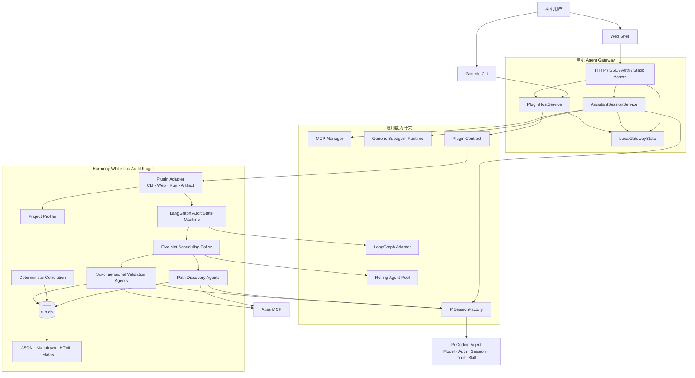

# v3.2 已实现系统架构

更新时间：2026-08-03

关键边界：

- 内置对话助手与领域插件在产品入口上平级，但对话是平台内置能力，不需要经过 Plugin Host；
- Plugin Host 只处理通用生命周期，Harmony 的页面、任务和报告语义全部位于插件包；
- Pi 负责单 Agent 的模型—工具循环，LangGraph 负责插件的多 Agent 流程状态；
- 平台 `gateway.db` 是本地 Job 索引，Harmony `run.db` 才是审计事实源；
- “最大五槽”属于 Harmony 调度策略，Core 只提供可配置的滚动池算法。
